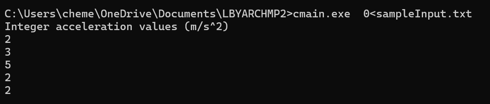

# LBYARCHMP2 - program output, correctness check, tests
Made by:  
Julian Briones  
Sidney Chan
# How to Compile and Run

```bash
nasm -f win64 asmMain.asm
gcc -c cmain.c -o cmain.obj -m64
gcc cmain.obj asmMain.obj -o cmain.exe -m64
cmain.exe < sampleInput.txt
```
or
```bash
run.bat
```
# output, correctness
We used sampleInput.txt for the input here, and ran run.bat  
the answers to the input were 2, 3, 5, 2, and 2  
we will check if they are really correct
## output image

input:  
5  
0.0, 62.5, 10.1  
60.0, 122.3, 5.5  
30.0, 160.7, 7.8  
45.0, 80.2, 6.4  
10.0, 55.5, 8.0  

(62.5KM/H - 0.0KM/H) / 10.1s
(62.5KM/H) / 10.1s
convert KM/H to m/s
([62.5KM/H * 1000M/H] * 1m/3600s) / 10.1s
(17.36M/s) / 10.1s
1.7188 m/s^2 ≈ 2m/s² (correct)

(122.3KM/H − 60.0KM/H) / 5.5s
(62.3KM/H) / 5.5s
convert KM/H to m/s
([62.3KM/H * 1000M/H] * 1m/3600s) / 5.5s
(17.31M/s) / 5.5s
3.146 m/s² ≈ 3m/s² (correct)

(160.7KM/H − 30.0KM/H) / 7.8s
(130.7KM/H) / 7.8s
convert KM/H to m/s
([130.7KM/H * 1000M/H] * 1m/3600s) / 7.8s
(36.31M/s) / 7.8s
4.658 m/s² ≈ 5m/s² (correct)

(80.2KM/H − 45.0KM/H) / 6.4s
(35.2KM/H) / 6.4s
convert KM/H to m/s
([35.2KM/H * 1000M/H] * 1m/3600s) / 6.4s
(9.78M/s) / 6.4s
1.528 m/s² ≈ 2m/s² (correct)

(55.5KM/H − 10.0KM/H) / 8.0s
(45.5KM/H) / 8.0s
convert KM/H to m/s
([45.5KM/H * 1000M/H] * 1m/3600s) / 8.0s
(12.64M/s) / 8.0s
1.580 m/s² ≈ 2m/s² (correct)

# testing
The tests include the average execution times of the function in C and Assembly and also the outputs of the two functions to cross check. Outputs will be shown below for Y = [10, 100, 1000, 10000], we will compare and analyze the execution times. 
## How to run tests
input Y size = 10
```bash
runTest10.bat
```
input Y size = 100
```bash
runTest100.bat
```
input Y size = 1000
```bash
runTest1000.bat
```
input Y size = 10000
```bash
runTest10000.bat
```

## results
We can see based on the tests that the assembly function was clearly faster than the c equivalent function in computing the acceleration, which becomes more apparent the more inputs there are, though the difference was noticable already with as little as 10 inputs. Assembly on average takes less time to complete based on these tests. The C equivalent function was easier to code, but the trade off was that it took longer to execute, while assembly was harder to code, but it executes faster. An instance of the tests for each Y input is shown below to demonstrate the average time for C and assembly function.
### Y = 10
Assembly run 1 time: 0.000000100000 seconds  
Assembly run 2 time: 0.000000400000 seconds  
Assembly run 3 time: 0.000000200000 seconds  
Assembly run 4 time: 0.000000300000 seconds  
Assembly run 5 time: 0.000000300000 seconds  
Assembly run 6 time: 0.000000200000 seconds  
Assembly run 7 time: 0.000000100000 seconds  
Assembly run 8 time: 0.000000400000 seconds  
Assembly run 9 time: 0.000000200000 seconds  
Assembly run 10 time: 0.000000300000 seconds  
Assembly run 11 time: 0.000000300000 seconds  
Assembly run 12 time: 0.000000500000 seconds  
Assembly run 13 time: 0.000000200000 seconds  
Assembly run 14 time: 0.000000400000 seconds  
Assembly run 15 time: 0.000000300000 seconds  
Assembly run 16 time: 0.000000200000 seconds  
Assembly run 17 time: 0.000000200000 seconds  
Assembly run 18 time: 0.000000200000 seconds  
Assembly run 19 time: 0.000000200000 seconds  
Assembly run 20 time: 0.000000100000 seconds  
Assembly run 21 time: 0.000000300000 seconds  
Assembly run 22 time: 0.000000300000 seconds  
Assembly run 23 time: 0.000000200000 seconds  
Assembly run 24 time: 0.000000300000 seconds  
Assembly run 25 time: 0.000000300000 seconds  
Assembly run 26 time: 0.000000300000 seconds  
Assembly run 27 time: 0.000000300000 seconds  
Assembly run 28 time: 0.000000400000 seconds  
Assembly run 29 time: 0.000000400000 seconds  
Assembly run 30 time: 0.000000400000 seconds  
Average Assembly time: 0.000000276667 seconds  

C run 1 time: 0.000001900000 seconds  
C run 2 time: 0.000001000000 seconds  
C run 3 time: 0.000001100000 seconds  
C run 4 time: 0.000001100000 seconds  
C run 5 time: 0.000001000000 seconds  
C run 6 time: 0.000001000000 seconds  
C run 7 time: 0.000001700000 seconds  
C run 8 time: 0.000001300000 seconds  
C run 9 time: 0.000000900000 seconds  
C run 10 time: 0.000000900000 seconds  
C run 11 time: 0.000001000000 seconds  
C run 12 time: 0.000000700000 seconds  
C run 13 time: 0.000001200000 seconds  
C run 14 time: 0.000000600000 seconds  
C run 15 time: 0.000000600000 seconds  
C run 16 time: 0.000000800000 seconds  
C run 17 time: 0.000001400000 seconds  
C run 18 time: 0.000000600000 seconds  
C run 19 time: 0.000000700000 seconds  
C run 20 time: 0.000001100000 seconds  
C run 21 time: 0.000001300000 seconds  
C run 22 time: 0.000000900000 seconds  
C run 23 time: 0.000000700000 seconds  
C run 24 time: 0.000001900000 seconds  
C run 25 time: 0.000001100000 seconds  
C run 26 time: 0.000000600000 seconds  
C run 27 time: 0.000001200000 seconds  
C run 28 time: 0.000001100000 seconds  
C run 29 time: 0.000001100000 seconds  
C run 30 time: 0.000000600000 seconds  
Average C time: 0.000001036667 seconds  

ASM results (m/s^2):
2
3
5
2
2
2
5
4
2
3

C results (m/s^2):
2
3
5
2
2
2
5
4
2
3

Assembly is faster on average: 0.000000276667 < 0.000001036667


### Y = 100

Assembly run 1 time: 0.000000400000 seconds  
Assembly run 2 time: 0.000000700000 seconds  
Assembly run 3 time: 0.000001000000 seconds  
Assembly run 4 time: 0.000000600000 seconds  
Assembly run 5 time: 0.000000600000 seconds  
Assembly run 6 time: 0.000009000000 seconds  
Assembly run 7 time: 0.000001000000 seconds  
Assembly run 8 time: 0.000001400000 seconds  
Assembly run 9 time: 0.000000600000 seconds  
Assembly run 10 time: 0.000001300000 seconds  
Assembly run 11 time: 0.000001200000 seconds  
Assembly run 12 time: 0.000000800000 seconds  
Assembly run 13 time: 0.000001300000 seconds  
Assembly run 14 time: 0.000001100000 seconds  
Assembly run 15 time: 0.000001300000 seconds  
Assembly run 16 time: 0.000001000000 seconds  
Assembly run 17 time: 0.000001000000 seconds  
Assembly run 18 time: 0.000000700000 seconds  
Assembly run 19 time: 0.000000400000 seconds  
Assembly run 20 time: 0.000001100000 seconds  
Assembly run 21 time: 0.000000600000 seconds  
Assembly run 22 time: 0.000000500000 seconds  
Assembly run 23 time: 0.000001100000 seconds  
Assembly run 24 time: 0.000000700000 seconds  
Assembly run 25 time: 0.000001000000 seconds  
Assembly run 26 time: 0.000000400000 seconds  
Assembly run 27 time: 0.000000400000 seconds  
Assembly run 28 time: 0.000000400000 seconds  
Assembly run 29 time: 0.000000800000 seconds  
Assembly run 30 time: 0.000000300000 seconds  
Average Assembly time: 0.000001090000 seconds  

C run 1 time: 0.000004700000 seconds  
C run 2 time: 0.000002100000 seconds  
C run 3 time: 0.000005700000 seconds  
C run 4 time: 0.000001900000 seconds  
C run 5 time: 0.000004800000 seconds  
C run 6 time: 0.000003800000 seconds  
C run 7 time: 0.000009700000 seconds  
C run 8 time: 0.000005100000 seconds  
C run 9 time: 0.000008400000 seconds  
C run 10 time: 0.000005100000 seconds  
C run 11 time: 0.000003600000 seconds  
C run 12 time: 0.000003700000 seconds  
C run 13 time: 0.000003700000 seconds  
C run 14 time: 0.000002300000 seconds  
C run 15 time: 0.000002100000 seconds  
C run 16 time: 0.000003000000 seconds  
C run 17 time: 0.000002300000 seconds  
C run 18 time: 0.000004700000 seconds  
C run 19 time: 0.000002100000 seconds  
C run 20 time: 0.000001900000 seconds  
C run 21 time: 0.000005300000 seconds  
C run 22 time: 0.000002000000 seconds  
C run 23 time: 0.000002500000 seconds  
C run 24 time: 0.000001700000 seconds  
C run 25 time: 0.000003300000 seconds  
C run 26 time: 0.000001700000 seconds  
C run 27 time: 0.000001900000 seconds  
C run 28 time: 0.000002600000 seconds  
C run 29 time: 0.000002000000 seconds  
C run 30 time: 0.000003600000 seconds  
Average C time: 0.000003576667 seconds  

ASM results (m/s^2):
2
3
5
2
2
2
5
4
2
3
2
3
5
2
2
2
5
4
2
3
2
3
5
2
2
2
5
4
2
3
2
3
5
2
2
2
5
4
2
3
2
3
5
2
2
2
5
4
2
3
2
3
5
2
2
2
5
4
2
3
2
3
5
2
2
2
5
4
2
3
2
3
5
2
2
2
5
4
2
3
2
3
5
2
2
2
5
4
2
3
2
3
5
2
2
2
5
4
2
3

C results (m/s^2):
2
3
5
2
2
2
5
4
2
3
2
3
5
2
2
2
5
4
2
3
2
3
5
2
2
2
5
4
2
3
2
3
5
2
2
2
5
4
2
3
2
3
5
2
2
2
5
4
2
3
2
3
5
2
2
2
5
4
2
3
2
3
5
2
2
2
5
4
2
3
2
3
5
2
2
2
5
4
2
3
2
3
5
2
2
2
5
4
2
3
2
3
5
2
2
2
5
4
2
3

Assembly is faster on average: 0.000001090000 < 0.000003576667

### Y = 1000

Assembly run 1 time: 0.000004900000 seconds  
Assembly run 2 time: 0.000006000000 seconds  
Assembly run 3 time: 0.000007500000 seconds  
Assembly run 4 time: 0.000007300000 seconds  
Assembly run 5 time: 0.000003200000 seconds  
Assembly run 6 time: 0.000003600000 seconds  
Assembly run 7 time: 0.000003600000 seconds  
Assembly run 8 time: 0.000010400000 seconds  
Assembly run 9 time: 0.000008700000 seconds  
Assembly run 10 time: 0.000007000000 seconds  
Assembly run 11 time: 0.000004600000 seconds  
Assembly run 12 time: 0.000009700000 seconds  
Assembly run 13 time: 0.000006200000 seconds  
Assembly run 14 time: 0.000006600000 seconds  
Assembly run 15 time: 0.000008000000 seconds  
Assembly run 16 time: 0.000007500000 seconds  
Assembly run 17 time: 0.000008500000 seconds  
Assembly run 18 time: 0.000003900000 seconds  
Assembly run 19 time: 0.000003800000 seconds  
Assembly run 20 time: 0.000003900000 seconds  
Assembly run 21 time: 0.000008600000 seconds  
Assembly run 22 time: 0.000004200000 seconds  
Assembly run 23 time: 0.000006400000 seconds  
Assembly run 24 time: 0.000008900000 seconds  
Assembly run 25 time: 0.000003400000 seconds  
Assembly run 26 time: 0.000007500000 seconds  
Assembly run 27 time: 0.000004800000 seconds  
Assembly run 28 time: 0.000007700000 seconds  
Assembly run 29 time: 0.000007400000 seconds  
Assembly run 30 time: 0.000007100000 seconds  
Average Assembly time: 0.000006363333 seconds  

C run 1 time: 0.000039400000 seconds  
C run 2 time: 0.000049800000 seconds  
C run 3 time: 0.000075200000 seconds  
C run 4 time: 0.000056700000 seconds  
C run 5 time: 0.000021900000 seconds  
C run 6 time: 0.000018800000 seconds  
C run 7 time: 0.000087000000 seconds  
C run 8 time: 0.000023100000 seconds  
C run 9 time: 0.000020900000 seconds  
C run 10 time: 0.000087000000 seconds  
C run 11 time: 0.000020500000 seconds  
C run 12 time: 0.000022000000 seconds  
C run 13 time: 0.000032600000 seconds  
C run 14 time: 0.000039700000 seconds  
C run 15 time: 0.000020700000 seconds  
C run 16 time: 0.000017900000 seconds  
C run 17 time: 0.000096100000 seconds  
C run 18 time: 0.000015800000 seconds  
C run 19 time: 0.000085400000 seconds  
C run 20 time: 0.000097500000 seconds  
C run 21 time: 0.000049800000 seconds  
C run 22 time: 0.000029300000 seconds  
C run 23 time: 0.000025400000 seconds  
C run 24 time: 0.000026300000 seconds  
C run 25 time: 0.000099600000 seconds  
C run 26 time: 0.000030600000 seconds  
C run 27 time: 0.000041100000 seconds  
C run 28 time: 0.000026100000 seconds  
C run 29 time: 0.000050300000 seconds  
C run 30 time: 0.000076000000 seconds  
Average C time: 0.000046083333 seconds  

ASM results (m/s^2):
2
3
5
2
2
2
5
4
2
3
2
3
5
2
2
2
5
4
2
3
2
3
5
2
2
2
5
4
2
3
2
3
5
2
2
2
5
4
2
3
2
3
5
2
2
2
5
4
2
3
2
3
5
2
2
2
5
4
2
3
2
3
5
2
2
2
5
4
2
3
2
3
5
2
2
2
5
4
2
3
2
3
5
2
2
2
5
4
2
3
2
3
5
2
2
2
5
4
2
3
2
3
5
2
2
2
5
4
2
3
2
3
5
2
2
2
5
4
2
3
2
3
5
2
2
2
5
4
2
3
2
3
5
2
2
2
5
4
2
3
2
3
5
2
2
2
5
4
2
3
2
3
5
2
2
2
5
4
2
3
2
3
5
2
2
2
5
4
2
3
2
3
5
2
2
2
5
4
2
3
2
3
5
2
2
2
5
4
2
3
2
3
5
2
2
2
5
4
2
3
2
3
5
2
2
2
5
4
2
3
2
3
5
2
2
2
5
4
2
3
2
3
5
2
2
2
5
4
2
3
2
3
5
2
2
2
5
4
2
3
2
3
5
2
2
2
5
4
2
3
2
3
5
2
2
2
5
4
2
3
2
3
5
2
2
2
5
4
2
3
2
3
5
2
2
2
5
4
2
3
2
3
5
2
2
2
5
4
2
3
2
3
5
2
2
2
5
4
2
3
2
3
5
2
2
2
5
4
2
3
2
3
5
2
2
2
5
4
2
3
2
3
5
2
2
2
5
4
2
3
2
3
5
2
2
2
5
4
2
3
2
3
5
2
2
2
5
4
2
3
2
3
5
2
2
2
5
4
2
3
2
3
5
2
2
2
5
4
2
3
2
3
5
2
2
2
5
4
2
3
2
3
5
2
2
2
5
4
2
3
2
3
5
2
2
2
5
4
2
3
2
3
5
2
2
2
5
4
2
3
2
3
5
2
2
2
5
4
2
3
2
3
5
2
2
2
5
4
2
3
2
3
5
2
2
2
5
4
2
3
2
3
5
2
2
2
5
4
2
3
2
3
5
2
2
2
5
4
2
3
2
3
5
2
2
2
5
4
2
3
2
3
5
2
2
2
5
4
2
3
2
3
5
2
2
2
5
4
2
3
2
3
5
2
2
2
5
4
2
3
2
3
5
2
2
2
5
4
2
3
2
3
5
2
2
2
5
4
2
3
2
3
5
2
2
2
5
4
2
3
2
3
5
2
2
2
5
4
2
3
2
3
5
2
2
2
5
4
2
3
2
3
5
2
2
2
5
4
2
3
2
3
5
2
2
2
5
4
2
3
2
3
5
2
2
2
5
4
2
3
2
3
5
2
2
2
5
4
2
3
2
3
5
2
2
2
5
4
2
3
2
3
5
2
2
2
5
4
2
3
2
3
5
2
2
2
5
4
2
3
2
3
5
2
2
2
5
4
2
3
2
3
5
2
2
2
5
4
2
3
2
3
5
2
2
2
5
4
2
3
2
3
5
2
2
2
5
4
2
3
2
3
5
2
2
2
5
4
2
3
2
3
5
2
2
2
5
4
2
3
2
3
5
2
2
2
5
4
2
3
2
3
5
2
2
2
5
4
2
3
2
3
5
2
2
2
5
4
2
3
2
3
5
2
2
2
5
4
2
3
2
3
5
2
2
2
5
4
2
3
2
3
5
2
2
2
5
4
2
3
2
3
5
2
2
2
5
4
2
3
2
3
5
2
2
2
5
4
2
3
2
3
5
2
2
2
5
4
2
3
2
3
5
2
2
2
5
4
2
3
2
3
5
2
2
2
5
4
2
3
2
3
5
2
2
2
5
4
2
3
2
3
5
2
2
2
5
4
2
3
2
3
5
2
2
2
5
4
2
3
2
3
5
2
2
2
5
4
2
3
2
3
5
2
2
2
5
4
2
3
2
3
5
2
2
2
5
4
2
3
2
3
5
2
2
2
5
4
2
3
2
3
5
2
2
2
5
4
2
3
2
3
5
2
2
2
5
4
2
3
2
3
5
2
2
2
5
4
2
3
2
3
5
2
2
2
5
4
2
3
2
3
5
2
2
2
5
4
2
3
2
3
5
2
2
2
5
4
2
3
2
3
5
2
2
2
5
4
2
3
2
3
5
2
2
2
5
4
2
3
2
3
5
2
2
2
5
4
2
3
2
3
5
2
2
2
5
4
2
3
2
3
5
2
2
2
5
4
2
3
2
3
5
2
2
2
5
4
2
3
2
3
5
2
2
2
5
4
2
3
2
3
5
2
2
2
5
4
2
3

C results (m/s^2):
2
3
5
2
2
2
5
4
2
3
2
3
5
2
2
2
5
4
2
3
2
3
5
2
2
2
5
4
2
3
2
3
5
2
2
2
5
4
2
3
2
3
5
2
2
2
5
4
2
3
2
3
5
2
2
2
5
4
2
3
2
3
5
2
2
2
5
4
2
3
2
3
5
2
2
2
5
4
2
3
2
3
5
2
2
2
5
4
2
3
2
3
5
2
2
2
5
4
2
3
2
3
5
2
2
2
5
4
2
3
2
3
5
2
2
2
5
4
2
3
2
3
5
2
2
2
5
4
2
3
2
3
5
2
2
2
5
4
2
3
2
3
5
2
2
2
5
4
2
3
2
3
5
2
2
2
5
4
2
3
2
3
5
2
2
2
5
4
2
3
2
3
5
2
2
2
5
4
2
3
2
3
5
2
2
2
5
4
2
3
2
3
5
2
2
2
5
4
2
3
2
3
5
2
2
2
5
4
2
3
2
3
5
2
2
2
5
4
2
3
2
3
5
2
2
2
5
4
2
3
2
3
5
2
2
2
5
4
2
3
2
3
5
2
2
2
5
4
2
3
2
3
5
2
2
2
5
4
2
3
2
3
5
2
2
2
5
4
2
3
2
3
5
2
2
2
5
4
2
3
2
3
5
2
2
2
5
4
2
3
2
3
5
2
2
2
5
4
2
3
2
3
5
2
2
2
5
4
2
3
2
3
5
2
2
2
5
4
2
3
2
3
5
2
2
2
5
4
2
3
2
3
5
2
2
2
5
4
2
3
2
3
5
2
2
2
5
4
2
3
2
3
5
2
2
2
5
4
2
3
2
3
5
2
2
2
5
4
2
3
2
3
5
2
2
2
5
4
2
3
2
3
5
2
2
2
5
4
2
3
2
3
5
2
2
2
5
4
2
3
2
3
5
2
2
2
5
4
2
3
2
3
5
2
2
2
5
4
2
3
2
3
5
2
2
2
5
4
2
3
2
3
5
2
2
2
5
4
2
3
2
3
5
2
2
2
5
4
2
3
2
3
5
2
2
2
5
4
2
3
2
3
5
2
2
2
5
4
2
3
2
3
5
2
2
2
5
4
2
3
2
3
5
2
2
2
5
4
2
3
2
3
5
2
2
2
5
4
2
3
2
3
5
2
2
2
5
4
2
3
2
3
5
2
2
2
5
4
2
3
2
3
5
2
2
2
5
4
2
3
2
3
5
2
2
2
5
4
2
3
2
3
5
2
2
2
5
4
2
3
2
3
5
2
2
2
5
4
2
3
2
3
5
2
2
2
5
4
2
3
2
3
5
2
2
2
5
4
2
3
2
3
5
2
2
2
5
4
2
3
2
3
5
2
2
2
5
4
2
3
2
3
5
2
2
2
5
4
2
3
2
3
5
2
2
2
5
4
2
3
2
3
5
2
2
2
5
4
2
3
2
3
5
2
2
2
5
4
2
3
2
3
5
2
2
2
5
4
2
3
2
3
5
2
2
2
5
4
2
3
2
3
5
2
2
2
5
4
2
3
2
3
5
2
2
2
5
4
2
3
2
3
5
2
2
2
5
4
2
3
2
3
5
2
2
2
5
4
2
3
2
3
5
2
2
2
5
4
2
3
2
3
5
2
2
2
5
4
2
3
2
3
5
2
2
2
5
4
2
3
2
3
5
2
2
2
5
4
2
3
2
3
5
2
2
2
5
4
2
3
2
3
5
2
2
2
5
4
2
3
2
3
5
2
2
2
5
4
2
3
2
3
5
2
2
2
5
4
2
3
2
3
5
2
2
2
5
4
2
3
2
3
5
2
2
2
5
4
2
3
2
3
5
2
2
2
5
4
2
3
2
3
5
2
2
2
5
4
2
3
2
3
5
2
2
2
5
4
2
3
2
3
5
2
2
2
5
4
2
3
2
3
5
2
2
2
5
4
2
3
2
3
5
2
2
2
5
4
2
3
2
3
5
2
2
2
5
4
2
3
2
3
5
2
2
2
5
4
2
3
2
3
5
2
2
2
5
4
2
3
2
3
5
2
2
2
5
4
2
3
2
3
5
2
2
2
5
4
2
3
2
3
5
2
2
2
5
4
2
3
2
3
5
2
2
2
5
4
2
3
2
3
5
2
2
2
5
4
2
3
2
3
5
2
2
2
5
4
2
3
2
3
5
2
2
2
5
4
2
3
2
3
5
2
2
2
5
4
2
3
2
3
5
2
2
2
5
4
2
3
2
3
5
2
2
2
5
4
2
3
2
3
5
2
2
2
5
4
2
3

Assembly is faster on average: 0.000006363333 < 0.000046083333

### Y = 10000
Assembly run 1 time: 0.000069600000 seconds  
Assembly run 2 time: 0.000127600000 seconds  
Assembly run 3 time: 0.000031800000 seconds  
Assembly run 4 time: 0.000042000000 seconds  
Assembly run 5 time: 0.000068000000 seconds  
Assembly run 6 time: 0.000150400000 seconds  
Assembly run 7 time: 0.000111000000 seconds  
Assembly run 8 time: 0.000055900000 seconds  
Assembly run 9 time: 0.000047000000 seconds  
Assembly run 10 time: 0.000033600000 seconds  
Assembly run 11 time: 0.000070700000 seconds  
Assembly run 12 time: 0.000141600000 seconds  
Assembly run 13 time: 0.000065300000 seconds  
Assembly run 14 time: 0.000079100000 seconds  
Assembly run 15 time: 0.000141100000 seconds  
Assembly run 16 time: 0.000095900000 seconds  
Assembly run 17 time: 0.000099300000 seconds  
Assembly run 18 time: 0.000096800000 seconds  
Assembly run 19 time: 0.000093700000 seconds  
Assembly run 20 time: 0.000042200000 seconds  
Assembly run 21 time: 0.000050900000 seconds  
Assembly run 22 time: 0.000226600000 seconds  
Assembly run 23 time: 0.000100200000 seconds  
Assembly run 24 time: 0.000168000000 seconds  
Assembly run 25 time: 0.000134500000 seconds  
Assembly run 26 time: 0.000225600000 seconds  
Assembly run 27 time: 0.000064000000 seconds  
Assembly run 28 time: 0.000058200000 seconds  
Assembly run 29 time: 0.000121500000 seconds  
Assembly run 30 time: 0.000045400000 seconds  
Average Assembly time: 0.000095250000 seconds  

C run 1 time: 0.000373200000 seconds  
C run 2 time: 0.000288400000 seconds  
C run 3 time: 0.000379300000 seconds  
C run 4 time: 0.000142100000 seconds  
C run 5 time: 0.000158600000 seconds  
C run 6 time: 0.000167000000 seconds  
C run 7 time: 0.000154600000 seconds  
C run 8 time: 0.000424300000 seconds  
C run 9 time: 0.000155000000 seconds  
C run 10 time: 0.000167000000 seconds  
C run 11 time: 0.000159400000 seconds  
C run 12 time: 0.000259500000 seconds  
C run 13 time: 0.000282200000 seconds  
C run 14 time: 0.000158900000 seconds  
C run 15 time: 0.000250200000 seconds  
C run 16 time: 0.000161100000 seconds  
C run 17 time: 0.000304600000 seconds  
C run 18 time: 0.000304400000 seconds  
C run 19 time: 0.000493100000 seconds  
C run 20 time: 0.000257900000 seconds  
C run 21 time: 0.000332400000 seconds  
C run 22 time: 0.000284200000 seconds  
C run 23 time: 0.000295100000 seconds  
C run 24 time: 0.000613900000 seconds  
C run 25 time: 0.000317000000 seconds  
C run 26 time: 0.000468100000 seconds  
C run 27 time: 0.000257200000 seconds  
C run 28 time: 0.000490200000 seconds  
C run 29 time: 0.000209200000 seconds  
C run 30 time: 0.000209000000 seconds  
Average C time: 0.000283903333 seconds  

ASM results (m/s^2): 2 3 5 2 2 2 5 4 2 3 2 3 5 2 2 2 5 4 2 3 2 3 5 2 2 2 5 4 2 3 2 3 5 2 2 2 5 4 2 3 2 3 5 2 2 2 5 4 2 3 2 3 5 2 2 2 5 4 2 3 2 3 5 2 2 2 5 4 2 3 2 3 5 2 2 2 5 4 2 3 2 3 5 2 2 2 5 4 2 3 2 3 5 2 2 2 5 4 2 3 2 3 5 2 2 2 5 4 2 3 2 3 5 2 2 2 5 4 2 3 2 3 5 2 2 2 5 4 2 3 2 3 5 2 2 2 5 4 2 3 2 3 5 2 2 2 5 4 2 3 2 3 5 2 2 2 5 4 2 3 2 3 5 2 2 2 5 4 2 3 2 3 5 2 2 2 5 4 2 3 2 3 5 2 2 2 5 4 2 3 2 3 5 2 2 2 5 4 2 3 2 3 5 2 2 2 5 4 2 3 2 3 5 2 2 2 5 4 2 3 2 3 5 2 2 2 5 4 2 3 2 3 5 2 2 2 5 4 2 3 2 3 5 2 2 2 5 4 2 3 2 3 5 2 2 2 5 4 2 3 2 3 5 2 2 2 5 4 2 3 2 3 5 2 2 2 5 4 2 3 2 3 5 2 2 2 5 4 2 3 2 3 5 2 2 2 5 4 2 3 2 3 5 2 2 2 5 4 2 3 2 3 5 2 2 2 5 4 2 3 2 3 5 2 2 2 5 4 2 3 2 3 5 2 2 2 5 4 2 3 2 3 5 2 2 2 5 4 2 3 2 3 5 2 2 2 5 4 2 3 2 3 5 2 2 2 5 4 2 3 2 3 5 2 2 2 5 4 2 3 2 3 5 2 2 2 5 4 2 3 2 3 5 2 2 2 5 4 2 3 2 3 5 2 2 2 5 4 2 3 2 3 5 2 2 2 5 4 2 3 2 3 5 2 2 2 5 4 2 3 2 3 5 2 2 2 5 4 2 3 2 3 5 2 2 2 5 4 2 3 2 3 5 2 2 2 5 4 2 3 2 3 5 2 2 2 5 4 2 3 2 3 5 2 2 2 5 4 2 3 2 3 5 2 2 2 5 4 2 3 2 3 5 2 2 2 5 4 2 3 2 3 5 2 2 2 5 4 2 3 2 3 5 2 2 2 5 4 2 3 2 3 5 2 2 2 5 4 2 3 2 3 5 2 2 2 5 4 2 3 2 3 5 2 2 2 5 4 2 3 2 3 5 2 2 2 5 4 2 3 2 3 5 2 2 2 5 4 2 3 2 3 5 2 2 2 5 4 2 3 2 3 5 2 2 2 5 4 2 3 2 3 5 2 2 2 5 4 2 3 2 3 5 2 2 2 5 4 2 3 2 3 5 2 2 2 5 4 2 3 2 3 5 2 2 2 5 4 2 3 2 3 5 2 2 2 5 4 2 3 2 3 5 2 2 2 5 4 2 3 2 3 5 2 2 2 5 4 2 3 2 3 5 2 2 2 5 4 2 3 2 3 5 2 2 2 5 4 2 3 2 3 5 2 2 2 5 4 2 3 2 3 5 2 2 2 5 4 2 3 2 3 5 2 2 2 5 4 2 3 2 3 5 2 2 2 5 4 2 3 2 3 5 2 2 2 5 4 2 3 2 3 5 2 2 2 5 4 2 3 2 3 5 2 2 2 5 4 2 3 2 3 5 2 2 2 5 4 2 3 2 3 5 2 2 2 5 4 2 3 2 3 5 2 2 2 5 4 2 3 2 3 5 2 2 2 5 4 2 3 2 3 5 2 2 2 5 4 2 3 2 3 5 2 2 2 5 4 2 3 2 3 5 2 2 2 5 4 2 3 2 3 5 2 2 2 5 4 2 3 2 3 5 2 2 2 5 4 2 3 2 3 5 2 2 2 5 4 2 3 2 3 5 2 2 2 5 4 2 3 2 3 5 2 2 2 5 4 2 3 2 3 5 2 2 2 5 4 2 3 2 3 5 2 2 2 5 4 2 3 2 3 5 2 2 2 5 4 2 3 2 3 5 2 2 2 5 4 2 3 2 3 5 2 2 2 5 4 2 3 2 3 5 2 2 2 5 4 2 3 2 3 5 2 2 2 5 4 2 3 2 3 5 2 2 2 5 4 2 3 2 3 5 2 2 2 5 4 2 3 2 3 5 2 2 2 5 4 2 3 2 3 5 2 2 2 5 4 2 3 2 3 5 2 2 2 5 4 2 3 2 3 5 2 2 2 5 4 2 3 2 3 5 2 2 2 5 4 2 3 2 3 5 2 2 2 5 4 2 3 2 3 5 2 2 2 5 4 2 3 2 3 5 2 2 2 5 4 2 3 2 3 5 2 2 2 5 4 2 3 2 3 5 2 2 2 5 4 2 3 2 3 5 2 2 2 5 4 2 3 2 3 5 2 2 2 5 4 2 3 2 3 5 2 2 2 5 4 2 3 2 3 5 2 2 2 5 4 2 3 2 3 5 2 2 2 5 4 2 3 2 3 5 2 2 2 5 4 2 3 2 3 5 2 2 2 5 4 2 3 2 3 5 2 2 2 5 4 2 3 2 3 5 2 2 2 5 4 2 3 2 3 5 2 2 2 5 4 2 3 2 3 5 2 2 2 5 4 2 3 2 3 5 2 2 2 5 4 2 3 2 3 5 2 2 2 5 4 2 3 2 3 5 2 2 2 5 4 2 3 2 3 5 2 2 2 5 4 2 3 2 3 5 2 2 2 5 4 2 3 2 3 5 2 2 2 5 4 2 3 2 3 5 2 2 2 5 4 2 3 2 3 5 2 2 2 5 4 2 3 2 3 5 2 2 2 5 4 2 3 2 3 5 2 2 2 5 4 2 3 2 3 5 2 2 2 5 4 2 3 2 3 5 2 2 2 5 4 2 3 2 3 5 2 2 2 5 4 2 3 2 3 5 2 2 2 5 4 2 3 2 3 5 2 2 2 5 4 2 3 2 3 5 2 2 2 5 4 2 3 2 3 5 2 2 2 5 4 2 3 2 3 5 2 2 2 5 4 2 3 2 3 5 2 2 2 5 4 2 3 2 3 5 2 2 2 5 4 2 3 2 3 5 2 2 2 5 4 2 3 2 3 5 2 2 2 5 4 2 3 2 3 5 2 2 2 5 4 2 3 2 3 5 2 2 2 5 4 2 3 2 3 5 2 2 2 5 4 2 3 2 3 5 2 2 2 5 4 2 3 2 3 5 2 2 2 5 4 2 3 2 3 5 2 2 2 5 4 2 3 2 3 5 2 2 2 5 4 2 3 2 3 5 2 2 2 5 4 2 3 2 3 5 2 2 2 5 4 2 3 2 3 5 2 2 2 5 4 2 3 2 3 5 2 2 2 5 4 2 3 2 3 5 2 2 2 5 4 2 3 2 3 5 2 2 2 5 4 2 3 2 3 5 2 2 2 5 4 2 3 2 3 5 2 2 2 5 4 2 3 2 3 5 2 2 2 5 4 2 3 2 3 5 2 2 2 5 4 2 3 2 3 5 2 2 2 5 4 2 3 2 3 5 2 2 2 5 4 2 3 2 3 5 2 2 2 5 4 2 3 2 3 5 2 2 2 5 4 2 3 2 3 5 2 2 2 5 4 2 3 2 3 5 2 2 2 5 4 2 3 2 3 5 2 2 2 5 4 2 3 2 3 5 2 2 2 5 4 2 3 2 3 5 2 2 2 5 4 2 3 2 3 5 2 2 2 5 4 2 3 2 3 5 2 2 2 5 4 2 3 2 3 5 2 2 2 5 4 2 3 2 3 5 2 2 2 5 4 2 3 2 3 5 2 2 2 5 4 2 3 2 3 5 2 2 2 5 4 2 3 2 3 5 2 2 2 5 4 2 3 2 3 5 2 2 2 5 4 2 3 2 3 5 2 2 2 5 4 2 3 2 3 5 2 2 2 5 4 2 3 2 3 5 2 2 2 5 4 2 3 2 3 5 2 2 2 5 4 2 3 2 3 5 2 2 2 5 4 2 3 2 3 5 2 2 2 5 4 2 3 2 3 5 2 2 2 5 4 2 3 2 3 5 2 2 2 5 4 2 3 2 3 5 2 2 2 5 4 2 3 2 3 5 2 2 2 5 4 2 3 2 3 5 2 2 2 5 4 2 3 2 3 5 2 2 2 5 4 2 3 2 3 5 2 2 2 5 4 2 3 2 3 5 2 2 2 5 4 2 3 2 3 5 2 2 2 5 4 2 3 2 3 5 2 2 2 5 4 2 3 2 3 5 2 2 2 5 4 2 3 2 3 5 2 2 2 5 4 2 3 2 3 5 2 2 2 5 4 2 3 2 3 5 2 2 2 5 4 2 3 2 3 5 2 2 2 5 4 2 3 2 3 5 2 2 2 5 4 2 3 2 3 5 2 2 2 5 4 2 3 2 3 5 2 2 2 5 4 2 3 2 3 5 2 2 2 5 4 2 3 2 3 5 2 2 2 5 4 2 3 2 3 5 2 2 2 5 4 2 3 2 3 5 2 2 2 5 4 2 3 2 3 5 2 2 2 5 4 2 3 2 3 5 2 2 2 5 4 2 3 2 3 5 2 2 2 5 4 2 3 2 3 5 2 2 2 5 4 2 3 2 3 5 2 2 2 5 4 2 3 2 3 5 2 2 2 5 4 2 3 2 3 5 2 2 2 5 4 2 3 2 3 5 2 2 2 5 4 2 3 2 3 5 2 2 2 5 4 2 3 2 3 5 2 2 2 5 4 2 3 2 3 5 2 2 2 5 4 2 3 2 3 5 2 2 2 5 4 2 3 2 3 5 2 2 2 5 4 2 3 2 3 5 2 2 2 5 4 2 3 2 3 5 2 2 2 5 4 2 3 2 3 5 2 2 2 5 4 2 3 2 3 5 2 2 2 5 4 2 3 2 3 5 2 2 2 5 4 2 3 2 3 5 2 2 2 5 4 2 3 2 3 5 2 2 2 5 4 2 3 2 3 5 2 2 2 5 4 2 3 2 3 5 2 2 2 5 4 2 3 2 3 5 2 2 2 5 4 2 3 2 3 5 2 2 2 5 4 2 3 2 3 5 2 2 2 5 4 2 3 2 3 5 2 2 2 5 4 2 3 2 3 5 2 2 2 5 4 2 3 2 3 5 2 2 2 5 4 2 3 2 3 5 2 2 2 5 4 2 3 2 3 5 2 2 2 5 4 2 3 2 3 5 2 2 2 5 4 2 3 2 3 5 2 2 2 5 4 2 3 2 3 5 2 2 2 5 4 2 3 2 3 5 2 2 2 5 4 2 3 2 3 5 2 2 2 5 4 2 3 2 3 5 2 2 2 5 4 2 3 2 3 5 2 2 2 5 4 2 3 2 3 5 2 2 2 5 4 2 3 2 3 5 2 2 2 5 4 2 3 2 3 5 2 2 2 5 4 2 3 2 3 5 2 2 2 5 4 2 3 2 3 5 2 2 2 5 4 2 3 2 3 5 2 2 2 5 4 2 3 2 3 5 2 2 2 5 4 2 3 2 3 5 2 2 2 5 4 2 3 2 3 5 2 2 2 5 4 2 3 2 3 5 2 2 2 5 4 2 3 2 3 5 2 2 2 5 4 2 3 2 3 5 2 2 2 5 4 2 3 2 3 5 2 2 2 5 4 2 3 2 3 5 2 2 2 5 4 2 3 2 3 5 2 2 2 5 4 2 3 2 3 5 2 2 2 5 4 2 3 2 3 5 2 2 2 5 4 2 3 2 3 5 2 2 2 5 4 2 3 2 3 5 2 2 2 5 4 2 3 2 3 5 2 2 2 5 4 2 3 2 3 5 2 2 2 5 4 2 3 2 3 5 2 2 2 5 4 2 3 2 3 5 2 2 2 5 4 2 3 2 3 5 2 2 2 5 4 2 3 2 3 5 2 2 2 5 4 2 3 2 3 5 2 2 2 5 4 2 3 2 3 5 2 2 2 5 4 2 3 2 3 5 2 2 2 5 4 2 3 2 3 5 2 2 2 5 4 2 3 2 3 5 2 2 2 5 4 2 3 2 3 5 2 2 2 5 4 2 3 2 3 5 2 2 2 5 4 2 3 2 3 5 2 2 2 5 4 2 3 2 3 5 2 2 2 5 4 2 3 2 3 5 2 2 2 5 4 2 3 2 3 5 2 2 2 5 4 2 3 2 3 5 2 2 2 5 4 2 3 2 3 5 2 2 2 5 4 2 3 2 3 5 2 2 2 5 4 2 3 2 3 5 2 2 2 5 4 2 3 2 3 5 2 2 2 5 4 2 3 2 3 5 2 2 2 5 4 2 3 2 3 5 2 2 2 5 4 2 3 2 3 5 2 2 2 5 4 2 3 2 3 5 2 2 2 5 4 2 3 2 3 5 2 2 2 5 4 2 3 2 3 5 2 2 2 5 4 2 3 2 3 5 2 2 2 5 4 2 3 2 3 5 2 2 2 5 4 2 3 2 3 5 2 2 2 5 4 2 3 2 3 5 2 2 2 5 4 2 3 2 3 5 2 2 2 5 4 2 3 2 3 5 2 2 2 5 4 2 3 2 3 5 2 2 2 5 4 2 3 2 3 5 2 2 2 5 4 2 3 2 3 5 2 2 2 5 4 2 3 2 3 5 2 2 2 5 4 2 3 2 3 5 2 2 2 5 4 2 3 2 3 5 2 2 2 5 4 2 3 2 3 5 2 2 2 5 4 2 3 2 3 5 2 2 2 5 4 2 3 2 3 5 2 2 2 5 4 2 3 2 3 5 2 2 2 5 4 2 3 2 3 5 2 2 2 5 4 2 3 2 3 5 2 2 2 5 4 2 3 2 3 5 2 2 2 5 4 2 3 2 3 5 2 2 2 5 4 2 3 2 3 5 2 2 2 5 4 2 3 2 3 5 2 2 2 5 4 2 3 2 3 5 2 2 2 5 4 2 3 2 3 5 2 2 2 5 4 2 3 2 3 5 2 2 2 5 4 2 3 2 3 5 2 2 2 5 4 2 3 2 3 5 2 2 2 5 4 2 3 2 3 5 2 2 2 5 4 2 3 2 3 5 2 2 2 5 4 2 3 2 3 5 2 2 2 5 4 2 3 2 3 5 2 2 2 5 4 2 3 2 3 5 2 2 2 5 4 2 3 2 3 5 2 2 2 5 4 2 3 2 3 5 2 2 2 5 4 2 3 2 3 5 2 2 2 5 4 2 3 2 3 5 2 2 2 5 4 2 3 2 3 5 2 2 2 5 4 2 3 2 3 5 2 2 2 5 4 2 3 2 3 5 2 2 2 5 4 2 3 2 3 5 2 2 2 5 4 2 3 2 3 5 2 2 2 5 4 2 3 2 3 5 2 2 2 5 4 2 3 2 3 5 2 2 2 5 4 2 3 2 3 5 2 2 2 5 4 2 3 2 3 5 2 2 2 5 4 2 3 2 3 5 2 2 2 5 4 2 3 2 3 5 2 2 2 5 4 2 3 2 3 5 2 2 2 5 4 2 3 2 3 5 2 2 2 5 4 2 3 2 3 5 2 2 2 5 4 2 3 2 3 5 2 2 2 5 4 2 3 2 3 5 2 2 2 5 4 2 3 2 3 5 2 2 2 5 4 2 3 2 3 5 2 2 2 5 4 2 3 2 3 5 2 2 2 5 4 2 3 2 3 5 2 2 2 5 4 2 3 2 3 5 2 2 2 5 4 2 3 2 3 5 2 2 2 5 4 2 3 2 3 5 2 2 2 5 4 2 3 2 3 5 2 2 2 5 4 2 3 2 3 5 2 2 2 5 4 2 3 2 3 5 2 2 2 5 4 2 3 2 3 5 2 2 2 5 4 2 3 2 3 5 2 2 2 5 4 2 3 2 3 5 2 2 2 5 4 2 3 2 3 5 2 2 2 5 4 2 3 2 3 5 2 2 2 5 4 2 3 2 3 5 2 2 2 5 4 2 3 2 3 5 2 2 2 5 4 2 3 2 3 5 2 2 2 5 4 2 3 2 3 5 2 2 2 5 4 2 3 2 3 5 2 2 2 5 4 2 3 2 3 5 2 2 2 5 4 2 3 2 3 5 2 2 2 5 4 2 3 2 3 5 2 2 2 5 4 2 3 2 3 5 2 2 2 5 4 2 3 2 3 5 2 2 2 5 4 2 3 2 3 5 2 2 2 5 4 2 3 2 3 5 2 2 2 5 4 2 3 2 3 5 2 2 2 5 4 2 3 2 3 5 2 2 2 5 4 2 3 2 3 5 2 2 2 5 4 2 3 2 3 5 2 2 2 5 4 2 3 2 3 5 2 2 2 5 4 2 3 2 3 5 2 2 2 5 4 2 3 2 3 5 2 2 2 5 4 2 3 2 3 5 2 2 2 5 4 2 3 2 3 5 2 2 2 5 4 2 3 2 3 5 2 2 2 5 4 2 3 2 3 5 2 2 2 5 4 2 3 2 3 5 2 2 2 5 4 2 3 2 3 5 2 2 2 5 4 2 3 2 3 5 2 2 2 5 4 2 3 2 3 5 2 2 2 5 4 2 3 2 3 5 2 2 2 5 4 2 3 2 3 5 2 2 2 5 4 2 3 2 3 5 2 2 2 5 4 2 3 2 3 5 2 2 2 5 4 2 3 2 3 5 2 2 2 5 4 2 3 2 3 5 2 2 2 5 4 2 3 2 3 5 2 2 2 5 4 2 3 2 3 5 2 2 2 5 4 2 3 2 3 5 2 2 2 5 4 2 3 2 3 5 2 2 2 5 4 2 3 2 3 5 2 2 2 5 4 2 3 2 3 5 2 2 2 5 4 2 3 2 3 5 2 2 2 5 4 2 3 2 3 5 2 2 2 5 4 2 3 2 3 5 2 2 2 5 4 2 3 2 3 5 2 2 2 5 4 2 3 2 3 5 2 2 2 5 4 2 3 2 3 5 2 2 2 5 4 2 3 2 3 5 2 2 2 5 4 2 3 2 3 5 2 2 2 5 4 2 3 2 3 5 2 2 2 5 4 2 3 2 3 5 2 2 2 5 4 2 3 2 3 5 2 2 2 5 4 2 3 2 3 5 2 2 2 5 4 2 3 2 3 5 2 2 2 5 4 2 3 2 3 5 2 2 2 5 4 2 3 2 3 5 2 2 2 5 4 2 3 2 3 5 2 2 2 5 4 2 3 2 3 5 2 2 2 5 4 2 3 2 3 5 2 2 2 5 4 2 3 2 3 5 2 2 2 5 4 2 3 2 3 5 2 2 2 5 4 2 3 2 3 5 2 2 2 5 4 2 3 2 3 5 2 2 2 5 4 2 3 2 3 5 2 2 2 5 4 2 3 2 3 5 2 2 2 5 4 2 3 2 3 5 2 2 2 5 4 2 3 2 3 5 2 2 2 5 4 2 3 2 3 5 2 2 2 5 4 2 3 2 3 5 2 2 2 5 4 2 3 2 3 5 2 2 2 5 4 2 3 2 3 5 2 2 2 5 4 2 3 2 3 5 2 2 2 5 4 2 3 2 3 5 2 2 2 5 4 2 3 2 3 5 2 2 2 5 4 2 3 2 3 5 2 2 2 5 4 2 3 2 3 5 2 2 2 5 4 2 3 2 3 5 2 2 2 5 4 2 3 2 3 5 2 2 2 5 4 2 3 2 3 5 2 2 2 5 4 2 3 2 3 5 2 2 2 5 4 2 3 2 3 5 2 2 2 5 4 2 3 2 3 5 2 2 2 5 4 2 3 2 3 5 2 2 2 5 4 2 3 2 3 5 2 2 2 5 4 2 3 2 3 5 2 2 2 5 4 2 3 2 3 5 2 2 2 5 4 2 3 2 3 5 2 2 2 5 4 2 3 2 3 5 2 2 2 5 4 2 3 2 3 5 2 2 2 5 4 2 3 2 3 5 2 2 2 5 4 2 3 2 3 5 2 2 2 5 4 2 3 2 3 5 2 2 2 5 4 2 3 2 3 5 2 2 2 5 4 2 3 2 3 5 2 2 2 5 4 2 3 2 3 5 2 2 2 5 4 2 3 2 3 5 2 2 2 5 4 2 3 2 3 5 2 2 2 5 4 2 3 2 3 5 2 2 2 5 4 2 3 2 3 5 2 2 2 5 4 2 3 2 3 5 2 2 2 5 4 2 3 2 3 5 2 2 2 5 4 2 3 2 3 5 2 2 2 5 4 2 3 2 3 5 2 2 2 5 4 2 3 2 3 5 2 2 2 5 4 2 3 2 3 5 2 2 2 5 4 2 3 2 3 5 2 2 2 5 4 2 3 2 3 5 2 2 2 5 4 2 3 2 3 5 2 2 2 5 4 2 3 2 3 5 2 2 2 5 4 2 3 2 3 5 2 2 2 5 4 2 3 2 3 5 2 2 2 5 4 2 3 2 3 5 2 2 2 5 4 2 3 2 3 5 2 2 2 5 4 2 3 2 3 5 2 2 2 5 4 2 3 2 3 5 2 2 2 5 4 2 3 2 3 5 2 2 2 5 4 2 3 2 3 5 2 2 2 5 4 2 3 2 3 5 2 2 2 5 4 2 3 2 3 5 2 2 2 5 4 2 3 2 3 5 2 2 2 5 4 2 3 2 3 5 2 2 2 5 4 2 3 2 3 5 2 2 2 5 4 2 3 2 3 5 2 2 2 5 4 2 3 2 3 5 2 2 2 5 4 2 3 2 3 5 2 2 2 5 4 2 3 2 3 5 2 2 2 5 4 2 3 2 3 5 2 2 2 5 4 2 3 2 3 5 2 2 2 5 4 2 3 2 3 5 2 2 2 5 4 2 3 2 3 5 2 2 2 5 4 2 3 2 3 5 2 2 2 5 4 2 3 2 3 5 2 2 2 5 4 2 3 2 3 5 2 2 2 5 4 2 3 2 3 5 2 2 2 5 4 2 3 2 3 5 2 2 2 5 4 2 3 2 3 5 2 2 2 5 4 2 3 2 3 5 2 2 2 5 4 2 3 2 3 5 2 2 2 5 4 2 3 2 3 5 2 2 2 5 4 2 3 2 3 5 2 2 2 5 4 2 3 2 3 5 2 2 2 5 4 2 3 2 3 5 2 2 2 5 4 2 3 2 3 5 2 2 2 5 4 2 3 2 3 5 2 2 2 5 4 2 3 2 3 5 2 2 2 5 4 2 3 2 3 5 2 2 2 5 4 2 3 2 3 5 2 2 2 5 4 2 3 2 3 5 2 2 2 5 4 2 3 2 3 5 2 2 2 5 4 2 3 2 3 5 2 2 2 5 4 2 3 2 3 5 2 2 2 5 4 2 3 2 3 5 2 2 2 5 4 2 3 2 3 5 2 2 2 5 4 2 3 2 3 5 2 2 2 5 4 2 3 2 3 5 2 2 2 5 4 2 3 2 3 5 2 2 2 5 4 2 3 2 3 5 2 2 2 5 4 2 3 2 3 5 2 2 2 5 4 2 3 2 3 5 2 2 2 5 4 2 3 2 3 5 2 2 2 5 4 2 3 2 3 5 2 2 2 5 4 2 3 2 3 5 2 2 2 5 4 2 3 2 3 5 2 2 2 5 4 2 3 2 3 5 2 2 2 5 4 2 3 2 3 5 2 2 2 5 4 2 3 2 3 5 2 2 2 5 4 2 3 2 3 5 2 2 2 5 4 2 3 2 3 5 2 2 2 5 4 2 3 2 3 5 2 2 2 5 4 2 3 2 3 5 2 2 2 5 4 2 3 2 3 5 2 2 2 5 4 2 3 2 3 5 2 2 2 5 4 2 3 2 3 5 2 2 2 5 4 2 3 2 3 5 2 2 2 5 4 2 3 2 3 5 2 2 2 5 4 2 3 2 3 5 2 2 2 5 4 2 3 2 3 5 2 2 2 5 4 2 3 2 3 5 2 2 2 5 4 2 3 2 3 5 2 2 2 5 4 2 3 2 3 5 2 2 2 5 4 2 3 2 3 5 2 2 2 5 4 2 3 2 3 5 2 2 2 5 4 2 3 2 3 5 2 2 2 5 4 2 3 2 3 5 2 2 2 5 4 2 3 2 3 5 2 2 2 5 4 2 3 2 3 5 2 2 2 5 4 2 3 2 3 5 2 2 2 5 4 2 3 2 3 5 2 2 2 5 4 2 3 2 3 5 2 2 2 5 4 2 3 2 3 5 2 2 2 5 4 2 3 2 3 5 2 2 2 5 4 2 3 2 3 5 2 2 2 5 4 2 3 2 3 5 2 2 2 5 4 2 3 2 3 5 2 2 2 5 4 2 3 2 3 5 2 2 2 5 4 2 3 2 3 5 2 2 2 5 4 2 3 2 3 5 2 2 2 5 4 2 3 2 3 5 2 2 2 5 4 2 3 2 3 5 2 2 2 5 4 2 3 2 3 5 2 2 2 5 4 2 3 2 3 5 2 2 2 5 4 2 3 2 3 5 2 2 2 5 4 2 3 2 3 5 2 2 2 5 4 2 3 2 3 5 2 2 2 5 4 2 3 2 3 5 2 2 2 5 4 2 3 2 3 5 2 2 2 5 4 2 3 2 3 5 2 2 2 5 4 2 3 2 3 5 2 2 2 5 4 2 3 2 3 5 2 2 2 5 4 2 3 2 3 5 2 2 2 5 4 2 3 2 3 5 2 2 2 5 4 2 3 2 3 5 2 2 2 5 4 2 3 2 3 5 2 2 2 5 4 2 3 2 3 5 2 2 2 5 4 2 3 2 3 5 2 2 2 5 4 2 3 2 3 5 2 2 2 5 4 2 3 2 3 5 2 2 2 5 4 2 3 2 3 5 2 2 2 5 4 2 3 2 3 5 2 2 2 5 4 2 3 2 3 5 2 2 2 5 4 2 3 2 3 5 2 2 2 5 4 2 3 2 3 5 2 2 2 5 4 2 3 2 3 5 2 2 2 5 4 2 3 2 3 5 2 2 2 5 4 2 3 2 3 5 2 2 2 5 4 2 3 2 3 5 2 2 2 5 4 2 3 2 3 5 2 2 2 5 4 2 3 2 3 5 2 2 2 5 4 2 3 2 3 5 2 2 2 5 4 2 3 2 3 5 2 2 2 5 4 2 3 2 3 5 2 2 2 5 4 2 3 2 3 5 2 2 2 5 4 2 3 2 3 5 2 2 2 5 4 2 3 2 3 5 2 2 2 5 4 2 3 2 3 5 2 2 2 5 4 2 3 2 3 5 2 2 2 5 4 2 3 2 3 5 2 2 2 5 4 2 3 2 3 5 2 2 2 5 4 2 3 2 3 5 2 2 2 5 4 2 3 2 3 5 2 2 2 5 4 2 3 2 3 5 2 2 2 5 4 2 3 2 3 5 2 2 2 5 4 2 3 2 3 5 2 2 2 5 4 2 3 2 3 5 2 2 2 5 4 2 3 2 3 5 2 2 2 5 4 2 3 2 3 5 2 2 2 5 4 2 3 2 3 5 2 2 2 5 4 2 3 2 3 5 2 2 2 5 4 2 3 2 3 5 2 2 2 5 4 2 3 2 3 5 2 2 2 5 4 2 3 2 3 5 2 2 2 5 4 2 3 2 3 5 2 2 2 5 4 2 3 2 3 5 2 2 2 5 4 2 3 2 3 5 2 2 2 5 4 2 3 2 3 5 2 2 2 5 4 2 3 2 3 5 2 2 2 5 4 2 3 2 3 5 2 2 2 5 4 2 3 2 3 5 2 2 2 5 4 2 3 2 3 5 2 2 2 5 4 2 3 2 3 5 2 2 2 5 4 2 3 2 3 5 2 2 2 5 4 2 3 2 3 5 2 2 2 5 4 2 3 2 3 5 2 2 2 5 4 2 3 2 3 5 2 2 2 5 4 2 3 2 3 5 2 2 2 5 4 2 3 2 3 5 2 2 2 5 4 2 3 2 3 5 2 2 2 5 4 2 3 2 3 5 2 2 2 5 4 2 3 2 3 5 2 2 2 5 4 2 3 2 3 5 2 2 2 5 4 2 3 2 3 5 2 2 2 5 4 2 3 2 3 5 2 2 2 5 4 2 3 2 3 5 2 2 2 5 4 2 3 2 3 5 2 2 2 5 4 2 3 2 3 5 2 2 2 5 4 2 3 2 3 5 2 2 2 5 4 2 3 2 3 5 2 2 2 5 4 2 3 2 3 5 2 2 2 5 4 2 3 2 3 5 2 2 2 5 4 2 3 2 3 5 2 2 2 5 4 2 3 2 3 5 2 2 2 5 4 2 3 2 3 5 2 2 2 5 4 2 3 2 3 5 2 2 2 5 4 2 3 2 3 5 2 2 2 5 4 2 3 2 3 5 2 2 2 5 4 2 3 2 3 5 2 2 2 5 4 2 3 2 3 5 2 2 2 5 4 2 3 2 3 5 2 2 2 5 4 2 3 2 3 5 2 2 2 5 4 2 3 2 3 5 2 2 2 5 4 2 3 2 3 5 2 2 2 5 4 2 3 2 3 5 2 2 2 5 4 2 3 2 3 5 2 2 2 5 4 2 3 2 3 5 2 2 2 5 4 2 3 2 3 5 2 2 2 5 4 2 3 2 3 5 2 2 2 5 4 2 3 2 3 5 2 2 2 5 4 2 3 2 3 5 2 2 2 5 4 2 3 2 3 5 2 2 2 5 4 2 3 2 3 5 2 2 2 5 4 2 3 2 3 5 2 2 2 5 4 2 3 2 3 5 2 2 2 5 4 2 3 2 3 5 2 2 2 5 4 2 3 2 3 5 2 2 2 5 4 2 3 2 3 5 2 2 2 5 4 2 3 2 3 5 2 2 2 5 4 2 3 2 3 5 2 2 2 5 4 2 3 2 3 5 2 2 2 5 4 2 3 2 3 5 2 2 2 5 4 2 3 2 3 5 2 2 2 5 4 2 3 2 3 5 2 2 2 5 4 2 3 2 3 5 2 2 2 5 4 2 3 2 3 5 2 2 2 5 4 2 3 2 3 5 2 2 2 5 4 2 3 2 3 5 2 2 2 5 4 2 3 2 3 5 2 2 2 5 4 2 3 2 3 5 2 2 2 5 4 2 3 2 3 5 2 2 2 5 4 2 3 2 3 5 2 2 2 5 4 2 3 2 3 5 2 2 2 5 4 2 3 2 3 5 2 2 2 5 4 2 3 2 3 5 2 2 2 5 4 2 3 2 3 5 2 2 2 5 4 2 3 2 3 5 2 2 2 5 4 2 3 2 3 5 2 2 2 5 4 2 3 2 3 5 2 2 2 5 4 2 3 2 3 5 2 2 2 5 4 2 3 2 3 5 2 2 2 5 4 2 3 2 3 5 2 2 2 5 4 2 3 2 3 5 2 2 2 5 4 2 3 2 3 5 2 2 2 5 4 2 3 2 3 5 2 2 2 5 4 2 3 2 3 5 2 2 2 5 4 2 3 2 3 5 2 2 2 5 4 2 3 2 3 5 2 2 2 5 4 2 3 2 3 5 2 2 2 5 4 2 3 2 3 5 2 2 2 5 4 2 3 2 3 5 2 2 2 5 4 2 3 2 3 5 2 2 2 5 4 2 3 2 3 5 2 2 2 5 4 2 3 2 3 5 2 2 2 5 4 2 3 2 3 5 2 2 2 5 4 2 3 2 3 5 2 2 2 5 4 2 3 2 3 5 2 2 2 5 4 2 3 2 3 5 2 2 2 5 4 2 3 2 3 5 2 2 2 5 4 2 3 2 3 5 2 2 2 5 4 2 3 2 3 5 2 2 2 5 4 2 3 2 3 5 2 2 2 5 4 2 3 2 3 5 2 2 2 5 4 2 3 2 3 5 2 2 2 5 4 2 3 2 3 5 2 2 2 5 4 2 3 2 3 5 2 2 2 5 4 2 3 2 3 5 2 2 2 5 4 2 3 2 3 5 2 2 2 5 4 2 3 2 3 5 2 2 2 5 4 2 3 2 3 5 2 2 2 5 4 2 3 2 3 5 2 2 2 5 4 2 3 2 3 5 2 2 2 5 4 2 3 2 3 5 2 2 2 5 4 2 3 2 3 5 2 2 2 5 4 2 3 2 3 5 2 2 2 5 4 2 3 2 3 5 2 2 2 5 4 2 3 2 3 5 2 2 2 5 4 2 3 2 3 5 2 2 2 5 4 2 3 2 3 5 2 2 2 5 4 2 3 2 3 5 2 2 2 5 4 2 3 2 3 5 2 2 2 5 4 2 3 2 3 5 2 2 2 5 4 2 3 2 3 5 2 2 2 5 4 2 3 2 3 5 2 2 2 5 4 2 3 2 3 5 2 2 2 5 4 2 3 2 3 5 2 2 2 5 4 2 3 2 3 5 2 2 2 5 4 2 3 2 3 5 2 2 2 5 4 2 3 2 3 5 2 2 2 5 4 2 3 2 3 5 2 2 2 5 4 2 3 2 3 5 2 2 2 5 4 2 3 2 3 5 2 2 2 5 4 2 3 2 3 5 2 2 2 5 4 2 3 2 3 5 2 2 2 5 4 2 3 2 3 5 2 2 2 5 4 2 3 2 3 5 2 2 2 5 4 2 3 2 3 5 2 2 2 5 4 2 3 2 3 5 2 2 2 5 4 2 3 2 3 5 2 2 2 5 4 2 3 2 3 5 2 2 2 5 4 2 3 2 3 5 2 2 2 5 4 2 3 2 3 5 2 2 2 5 4 2 3 2 3 5 2 2 2 5 4 2 3 2 3 5 2 2 2 5 4 2 3 2 3 5 2 2 2 5 4 2 3 2 3 5 2 2 2 5 4 2 3 2 3 5 2 2 2 5 4 2 3 2 3 5 2 2 2 5 4 2 3 2 3 5 2 2 2 5 4 2 3 2 3 5 2 2 2 5 4 2 3 2 3 5 2 2 2 5 4 2 3 2 3 5 2 2 2 5 4 2 3 2 3 5 2 2 2 5 4 2 3 2 3 5 2 2 2 5 4 2 3 2 3 5 2 2 2 5 4 2 3 2 3 5 2 2 2 5 4 2 3 2 3 5 2 2 2 5 4 2 3 2 3 5 2 2 2 5 4 2 3 2 3 5 2 2 2 5 4 2 3 2 3 5 2 2 2 5 4 2 3 2 3 5 2 2 2 5 4 2 3 2 3 5 2 2 2 5 4 2 3 2 3 5 2 2 2 5 4 2 3 2 3 5 2 2 2 5 4 2 3 2 3 5 2 2 2 5 4 2 3 2 3 5 2 2 2 5 4 2 3 2 3 5 2 2 2 5 4 2 3 2 3 5 2 2 2 5 4 2 3 2 3 5 2 2 2 5 4 2 3 2 3 5 2 2 2 5 4 2 3 2 3 5 2 2 2 5 4 2 3 2 3 5 2 2 2 5 4 2 3 2 3 5 2 2 2 5 4 2 3 2 3 5 2 2 2 5 4 2 3 2 3 5 2 2 2 5 4 2 3 2 3 5 2 2 2 5 4 2 3 2 3 5 2 2 2 5 4 2 3 2 3 5 2 2 2 5 4 2 3 2 3 5 2 2 2 5 4 2 3 2 3 5 2 2 2 5 4 2 3 2 3 5 2 2 2 5 4 2 3 2 3 5 2 2 2 5 4 2 3 2 3 5 2 2 2 5 4 2 3 2 3 5 2 2 2 5 4 2 3 2 3 5 2 2 2 5 4 2 3 2 3 5 2 2 2 5 4 2 3 2 3 5 2 2 2 5 4 2 3 2 3 5 2 2 2 5 4 2 3 2 3 5 2 2 2 5 4 2 3 2 3 5 2 2 2 5 4 2 3 2 3 5 2 2 2 5 4 2 3 2 3 5 2 2 2 5 4 2 3 2 3 5 2 2 2 5 4 2 3 2 3 5 2 2 2 5 4 2 3 2 3 5 2 2 2 5 4 2 3 2 3 5 2 2 2 5 4 2 3 2 3 5 2 2 2 5 4 2 3 2 3 5 2 2 2 5 4 2 3 2 3 5 2 2 2 5 4 2 3 2 3 5 2 2 2 5 4 2 3 2 3 5 2 2 2 5 4 2 3 2 3 5 2 2 2 5 4 2 3 2 3 5 2 2 2 5 4 2 3 2 3 5 2 2 2 5 4 2 3 2 3 5 2 2 2 5 4 2 3 2 3 5 2 2 2 5 4 2 3 2 3 5 2 2 2 5 4 2 3 2 3 5 2 2 2 5 4 2 3 2 3 5 2 2 2 5 4 2 3 2 3 5 2 2 2 5 4 2 3 2 3 5 2 2 2 5 4 2 3 2 3 5 2 2 2 5 4 2 3 2 3 5 2 2 2 5 4 2 3 2 3 5 2 2 2 5 4 2 3 2 3 5 2 2 2 5 4 2 3 2 3 5 2 2 2 5 4 2 3 2 3 5 2 2 2 5 4 2 3 2 3 5 2 2 2 5 4 2 3 2 3 5 2 2 2 5 4 2 3 2 3 5 2 2 2 5 4 2 3 2 3 5 2 2 2 5 4 2 3 2 3 5 2 2 2 5 4 2 3 2 3 5 2 2 2 5 4 2 3 2 3 5 2 2 2 5 4 2 3 2 3 5 2 2 2 5 4 2 3 2 3 5 2 2 2 5 4 2 3 2 3 5 2 2 2 5 4 2 3 2 3 5 2 2 2 5 4 2 3 2 3 5 2 2 2 5 4 2 3 2 3 5 2 2 2 5 4 2 3 2 3 5 2 2 2 5 4 2 3 2 3 5 2 2 2 5 4 2 3 2 3 5 2 2 2 5 4 2 3 2 3 5 2 2 2 5 4 2 3 2 3 5 2 2 2 5 4 2 3 2 3 5 2 2 2 5 4 2 3 2 3 5 2 2 2 5 4 2 3 2 3 5 2 2 2 5 4 2 3 2 3 5 2 2 2 5 4 2 3 2 3 5 2 2 2 5 4 2 3 2 3 5 2 2 2 5 4 2 3 2 3 5 2 2 2 5 4 2 3 2 3 5 2 2 2 5 4 2 3 2 3 5 2 2 2 5 4 2 3 2 3 5 2 2 2 5 4 2 3 2 3 5 2 2 2 5 4 2 3 2 3 5 2 2 2 5 4 2 3 2 3 5 2 2 2 5 4 2 3 2 3 5 2 2 2 5 4 2 3 2 3 5 2 2 2 5 4 2 3 2 3 5 2 2 2 5 4 2 3 2 3 5 2 2 2 5 4 2 3 2 3 5 2 2 2 5 4 2 3 2 3 5 2 2 2 5 4 2 3 2 3 5 2 2 2 5 4 2 3 2 3 5 2 2 2 5 4 2 3 2 3 5 2 2 2 5 4 2 3 2 3 5 2 2 2 5 4 2 3 2 3 5 2 2 2 5 4 2 3 2 3 5 2 2 2 5 4 2 3 2 3 5 2 2 2 5 4 2 3 2 3 5 2 2 2 5 4 2 3 2 3 5 2 2 2 5 4 2 3 2 3 5 2 2 2 5 4 2 3 2 3 5 2 2 2 5 4 2 3 2 3 5 2 2 2 5 4 2 3 2 3 5 2 2 2 5 4 2 3 2 3 5 2 2 2 5 4 2 3 2 3 5 2 2 2 5 4 2 3 2 3 5 2 2 2 5 4 2 3 2 3 5 2 2 2 5 4 2 3 2 3 5 2 2 2 5 4 2 3 2 3 5 2 2 2 5 4 2 3 2 3 5 2 2 2 5 4 2 3 2 3 5 2 2 2 5 4 2 3 2 3 5 2 2 2 5 4 2 3 2 3 5 2 2 2 5 4 2 3 2 3 5 2 2 2 5 4 2 3 2 3 5 2 2 2 5 4 2 3 2 3 5 2 2 2 5 4 2 3 2 3 5 2 2 2 5 4 2 3 2 3 5 2 2 2 5 4 2 3 2 3 5 2 2 2 5 4 2 3 2 3 5 2 2 2 5 4 2 3 2 3 5 2 2 2 5 4 2 3 2 3 5 2 2 2 5 4 2 3 2 3 5 2 2 2 5 4 2 3 2 3 5 2 2 2 5 4 2 3 2 3 5 2 2 2 5 4 2 3 2 3 5 2 2 2 5 4 2 3 2 3 5 2 2 2 5 4 2 3 2 3 5 2 2 2 5 4 2 3 2 3 5 2 2 2 5 4 2 3 2 3 5 2 2 2 5 4 2 3 2 3 5 2 2 2 5 4 2 3 2 3 5 2 2 2 5 4 2 3 2 3 5 2 2 2 5 4 2 3 2 3 5 2 2 2 5 4 2 3 2 3 5 2 2 2 5 4 2 3 2 3 5 2 2 2 5 4 2 3 2 3 5 2 2 2 5 4 2 3 2 3 5 2 2 2 5 4 2 3 2 3 5 2 2 2 5 4 2 3 2 3 5 2 2 2 5 4 2 3 2 3 5 2 2 2 5 4 2 3 2 3 5 2 2 2 5 4 2 3 2 3 5 2 2 2 5 4 2 3 2 3 5 2 2 2 5 4 2 3 2 3 5 2 2 2 5 4 2 3 2 3 5 2 2 2 5 4 2 3 2 3 5 2 2 2 5 4 2 3 2 3 5 2 2 2 5 4 2 3 2 3 5 2 2 2 5 4 2 3 2 3 5 2 2 2 5 4 2 3 2 3 5 2 2 2 5 4 2 3 2 3 5 2 2 2 5 4 2 3 2 3 5 2 2 2 5 4 2 3 2 3 5 2 2 2 5 4 2 3 2 3 5 2 2 2 5 4 2 3 2 3 5 2 2 2 5 4 2 3 2 3 5 2 2 2 5 4 2 3 2 3 5 2 2 2 5 4 2 3 2 3 5 2 2 2 5 4 2 3 2 3 5 2 2 2 5 4 2 3 2 3 5 2 2 2 5 4 2 3 2 3 5 2 2 2 5 4 2 3 2 3 5 2 2 2 5 4 2 3 2 3 5 2 2 2 5 4 2 3 2 3 5 2 2 2 5 4 2 3 2 3 5 2 2 2 5 4 2 3 2 3 5 2 2 2 5 4 2 3 2 3 5 2 2 2 5 4 2 3 2 3 5 2 2 2 5 4 2 3 2 3 5 2 2 2 5 4 2 3 2 3 5 2 2 2 5 4 2 3 2 3 5 2 2 2 5 4 2 3 2 3 5 2 2 2 5 4 2 3 2 3 5 2 2 2 5 4 2 3 2 3 5 2 2 2 5 4 2 3 2 3 5 2 2 2 5 4 2 3 2 3 5 2 2 2 5 4 2 3 2 3 5 2 2 2 5 4 2 3 2 3 5 2 2 2 5 4 2 3 2 3 5 2 2 2 5 4 2 3 2 3 5 2 2 2 5 4 2 3 2 3 5 2 2 2 5 4 2 3 2 3 5 2 2 2 5 4 2 3 2 3 5 2 2 2 5 4 2 3 2 3 5 2 2 2 5 4 2 3 2 3 5 2 2 2 5 4 2 3 2 3 5 2 2 2 5 4 2 3 2 3 5 2 2 2 5 4 2 3 2 3 5 2 2 2 5 4 2 3 2 3 5 2 2 2 5 4 2 3 2 3 5 2 2 2 5 4 2 3 2 3 5 2 2 2 5 4 2 3 2 3 5 2 2 2 5 4 2 3 2 3 5 2 2 2 5 4 2 3 2 3 5 2 2 2 5 4 2 3 2 3 5 2 2 2 5 4 2 3 2 3 5 2 2 2 5 4 2 3 2 3 5 2 2 2 5 4 2 3 2 3 5 2 2 2 5 4 2 3 2 3 5 2 2 2 5 4 2 3 2 3 5 2 2 2 5 4 2 3 2 3 5 2 2 2 5 4 2 3 2 3 5 2 2 2 5 4 2 3 2 3 5 2 2 2 5 4 2 3 2 3 5 2 2 2 5 4 2 3 2 3 5 2 2 2 5 4 2 3 2 3 5 2 2 2 5 4 2 3 2 3 5 2 2 2 5 4 2 3 2 3 5 2 2 2 5 4 2 3 2 3 5 2 2 2 5 4 2 3 2 3 5 2 2 2 5 4 2 3 2 3 5 2 2 2 5 4 2 3 2 3 5 2 2 2 5 4 2 3 2 3 5 2 2 2 5 4 2 3 2 3 5 2 2 2 5 4 2 3 2 3 5 2 2 2 5 4 2 3 2 3 5 2 2 2 5 4 2 3 2 3 5 2 2 2 5 4 2 3 2 3 5 2 2 2 5 4 2 3 2 3 5 2 2 2 5 4 2 3 2 3 5 2 2 2 5 4 2 3 2 3 5 2 2 2 5 4 2 3 2 3 5 2 2 2 5 4 2 3 2 3 5 2 2 2 5 4 2 3 2 3 5 2 2 2 5 4 2 3 2 3 5 2 2 2 5 4 2 3 2 3 5 2 2 2 5 4 2 3 2 3 5 2 2 2 5 4 2 3 2 3 5 2 2 2 5 4 2 3 2 3 5 2 2 2 5 4 2 3 2 3 5 2 2 2 5 4 2 3 2 3 5 2 2 2 5 4 2 3 2 3 5 2 2 2 5 4 2 3 2 3 5 2 2 2 5 4 2 3 2 3 5 2 2 2 5 4 2 3 2 3 5 2 2 2 5 4 2 3 2 3 5 2 2 2 5 4 2 3 2 3 5 2 2 2 5 4 2 3 2 3 5 2 2 2 5 4 2 3
C results (m/s^2): 2 3 5 2 2 2 5 4 2 3 2 3 5 2 2 2 5 4 2 3 2 3 5 2 2 2 5 4 2 3 2 3 5 2 2 2 5 4 2 3 2 3 5 2 2 2 5 4 2 3 2 3 5 2 2 2 5 4 2 3 2 3 5 2 2 2 5 4 2 3 2 3 5 2 2 2 5 4 2 3 2 3 5 2 2 2 5 4 2 3 2 3 5 2 2 2 5 4 2 3 2 3 5 2 2 2 5 4 2 3 2 3 5 2 2 2 5 4 2 3 2 3 5 2 2 2 5 4 2 3 2 3 5 2 2 2 5 4 2 3 2 3 5 2 2 2 5 4 2 3 2 3 5 2 2 2 5 4 2 3 2 3 5 2 2 2 5 4 2 3 2 3 5 2 2 2 5 4 2 3 2 3 5 2 2 2 5 4 2 3 2 3 5 2 2 2 5 4 2 3 2 3 5 2 2 2 5 4 2 3 2 3 5 2 2 2 5 4 2 3 2 3 5 2 2 2 5 4 2 3 2 3 5 2 2 2 5 4 2 3 2 3 5 2 2 2 5 4 2 3 2 3 5 2 2 2 5 4 2 3 2 3 5 2 2 2 5 4 2 3 2 3 5 2 2 2 5 4 2 3 2 3 5 2 2 2 5 4 2 3 2 3 5 2 2 2 5 4 2 3 2 3 5 2 2 2 5 4 2 3 2 3 5 2 2 2 5 4 2 3 2 3 5 2 2 2 5 4 2 3 2 3 5 2 2 2 5 4 2 3 2 3 5 2 2 2 5 4 2 3 2 3 5 2 2 2 5 4 2 3 2 3 5 2 2 2 5 4 2 3 2 3 5 2 2 2 5 4 2 3 2 3 5 2 2 2 5 4 2 3 2 3 5 2 2 2 5 4 2 3 2 3 5 2 2 2 5 4 2 3 2 3 5 2 2 2 5 4 2 3 2 3 5 2 2 2 5 4 2 3 2 3 5 2 2 2 5 4 2 3 2 3 5 2 2 2 5 4 2 3 2 3 5 2 2 2 5 4 2 3 2 3 5 2 2 2 5 4 2 3 2 3 5 2 2 2 5 4 2 3 2 3 5 2 2 2 5 4 2 3 2 3 5 2 2 2 5 4 2 3 2 3 5 2 2 2 5 4 2 3 2 3 5 2 2 2 5 4 2 3 2 3 5 2 2 2 5 4 2 3 2 3 5 2 2 2 5 4 2 3 2 3 5 2 2 2 5 4 2 3 2 3 5 2 2 2 5 4 2 3 2 3 5 2 2 2 5 4 2 3 2 3 5 2 2 2 5 4 2 3 2 3 5 2 2 2 5 4 2 3 2 3 5 2 2 2 5 4 2 3 2 3 5 2 2 2 5 4 2 3 2 3 5 2 2 2 5 4 2 3 2 3 5 2 2 2 5 4 2 3 2 3 5 2 2 2 5 4 2 3 2 3 5 2 2 2 5 4 2 3 2 3 5 2 2 2 5 4 2 3 2 3 5 2 2 2 5 4 2 3 2 3 5 2 2 2 5 4 2 3 2 3 5 2 2 2 5 4 2 3 2 3 5 2 2 2 5 4 2 3 2 3 5 2 2 2 5 4 2 3 2 3 5 2 2 2 5 4 2 3 2 3 5 2 2 2 5 4 2 3 2 3 5 2 2 2 5 4 2 3 2 3 5 2 2 2 5 4 2 3 2 3 5 2 2 2 5 4 2 3 2 3 5 2 2 2 5 4 2 3 2 3 5 2 2 2 5 4 2 3 2 3 5 2 2 2 5 4 2 3 2 3 5 2 2 2 5 4 2 3 2 3 5 2 2 2 5 4 2 3 2 3 5 2 2 2 5 4 2 3 2 3 5 2 2 2 5 4 2 3 2 3 5 2 2 2 5 4 2 3 2 3 5 2 2 2 5 4 2 3 2 3 5 2 2 2 5 4 2 3 2 3 5 2 2 2 5 4 2 3 2 3 5 2 2 2 5 4 2 3 2 3 5 2 2 2 5 4 2 3 2 3 5 2 2 2 5 4 2 3 2 3 5 2 2 2 5 4 2 3 2 3 5 2 2 2 5 4 2 3 2 3 5 2 2 2 5 4 2 3 2 3 5 2 2 2 5 4 2 3 2 3 5 2 2 2 5 4 2 3 2 3 5 2 2 2 5 4 2 3 2 3 5 2 2 2 5 4 2 3 2 3 5 2 2 2 5 4 2 3 2 3 5 2 2 2 5 4 2 3 2 3 5 2 2 2 5 4 2 3 2 3 5 2 2 2 5 4 2 3 2 3 5 2 2 2 5 4 2 3 2 3 5 2 2 2 5 4 2 3 2 3 5 2 2 2 5 4 2 3 2 3 5 2 2 2 5 4 2 3 2 3 5 2 2 2 5 4 2 3 2 3 5 2 2 2 5 4 2 3 2 3 5 2 2 2 5 4 2 3 2 3 5 2 2 2 5 4 2 3 2 3 5 2 2 2 5 4 2 3 2 3 5 2 2 2 5 4 2 3 2 3 5 2 2 2 5 4 2 3 2 3 5 2 2 2 5 4 2 3 2 3 5 2 2 2 5 4 2 3 2 3 5 2 2 2 5 4 2 3 2 3 5 2 2 2 5 4 2 3 2 3 5 2 2 2 5 4 2 3 2 3 5 2 2 2 5 4 2 3 2 3 5 2 2 2 5 4 2 3 2 3 5 2 2 2 5 4 2 3 2 3 5 2 2 2 5 4 2 3 2 3 5 2 2 2 5 4 2 3 2 3 5 2 2 2 5 4 2 3 2 3 5 2 2 2 5 4 2 3 2 3 5 2 2 2 5 4 2 3 2 3 5 2 2 2 5 4 2 3 2 3 5 2 2 2 5 4 2 3 2 3 5 2 2 2 5 4 2 3 2 3 5 2 2 2 5 4 2 3 2 3 5 2 2 2 5 4 2 3 2 3 5 2 2 2 5 4 2 3 2 3 5 2 2 2 5 4 2 3 2 3 5 2 2 2 5 4 2 3 2 3 5 2 2 2 5 4 2 3 2 3 5 2 2 2 5 4 2 3 2 3 5 2 2 2 5 4 2 3 2 3 5 2 2 2 5 4 2 3 2 3 5 2 2 2 5 4 2 3 2 3 5 2 2 2 5 4 2 3 2 3 5 2 2 2 5 4 2 3 2 3 5 2 2 2 5 4 2 3 2 3 5 2 2 2 5 4 2 3 2 3 5 2 2 2 5 4 2 3 2 3 5 2 2 2 5 4 2 3 2 3 5 2 2 2 5 4 2 3 2 3 5 2 2 2 5 4 2 3 2 3 5 2 2 2 5 4 2 3 2 3 5 2 2 2 5 4 2 3 2 3 5 2 2 2 5 4 2 3 2 3 5 2 2 2 5 4 2 3 2 3 5 2 2 2 5 4 2 3 2 3 5 2 2 2 5 4 2 3 2 3 5 2 2 2 5 4 2 3 2 3 5 2 2 2 5 4 2 3 2 3 5 2 2 2 5 4 2 3 2 3 5 2 2 2 5 4 2 3 2 3 5 2 2 2 5 4 2 3 2 3 5 2 2 2 5 4 2 3 2 3 5 2 2 2 5 4 2 3 2 3 5 2 2 2 5 4 2 3 2 3 5 2 2 2 5 4 2 3 2 3 5 2 2 2 5 4 2 3 2 3 5 2 2 2 5 4 2 3 2 3 5 2 2 2 5 4 2 3 2 3 5 2 2 2 5 4 2 3 2 3 5 2 2 2 5 4 2 3 2 3 5 2 2 2 5 4 2 3 2 3 5 2 2 2 5 4 2 3 2 3 5 2 2 2 5 4 2 3 2 3 5 2 2 2 5 4 2 3 2 3 5 2 2 2 5 4 2 3 2 3 5 2 2 2 5 4 2 3 2 3 5 2 2 2 5 4 2 3 2 3 5 2 2 2 5 4 2 3 2 3 5 2 2 2 5 4 2 3 2 3 5 2 2 2 5 4 2 3 2 3 5 2 2 2 5 4 2 3 2 3 5 2 2 2 5 4 2 3 2 3 5 2 2 2 5 4 2 3 2 3 5 2 2 2 5 4 2 3 2 3 5 2 2 2 5 4 2 3 2 3 5 2 2 2 5 4 2 3 2 3 5 2 2 2 5 4 2 3 2 3 5 2 2 2 5 4 2 3 2 3 5 2 2 2 5 4 2 3 2 3 5 2 2 2 5 4 2 3 2 3 5 2 2 2 5 4 2 3 2 3 5 2 2 2 5 4 2 3 2 3 5 2 2 2 5 4 2 3 2 3 5 2 2 2 5 4 2 3 2 3 5 2 2 2 5 4 2 3 2 3 5 2 2 2 5 4 2 3 2 3 5 2 2 2 5 4 2 3 2 3 5 2 2 2 5 4 2 3 2 3 5 2 2 2 5 4 2 3 2 3 5 2 2 2 5 4 2 3 2 3 5 2 2 2 5 4 2 3 2 3 5 2 2 2 5 4 2 3 2 3 5 2 2 2 5 4 2 3 2 3 5 2 2 2 5 4 2 3 2 3 5 2 2 2 5 4 2 3 2 3 5 2 2 2 5 4 2 3 2 3 5 2 2 2 5 4 2 3 2 3 5 2 2 2 5 4 2 3 2 3 5 2 2 2 5 4 2 3 2 3 5 2 2 2 5 4 2 3 2 3 5 2 2 2 5 4 2 3 2 3 5 2 2 2 5 4 2 3 2 3 5 2 2 2 5 4 2 3 2 3 5 2 2 2 5 4 2 3 2 3 5 2 2 2 5 4 2 3 2 3 5 2 2 2 5 4 2 3 2 3 5 2 2 2 5 4 2 3 2 3 5 2 2 2 5 4 2 3 2 3 5 2 2 2 5 4 2 3 2 3 5 2 2 2 5 4 2 3 2 3 5 2 2 2 5 4 2 3 2 3 5 2 2 2 5 4 2 3 2 3 5 2 2 2 5 4 2 3 2 3 5 2 2 2 5 4 2 3 2 3 5 2 2 2 5 4 2 3 2 3 5 2 2 2 5 4 2 3 2 3 5 2 2 2 5 4 2 3 2 3 5 2 2 2 5 4 2 3 2 3 5 2 2 2 5 4 2 3 2 3 5 2 2 2 5 4 2 3 2 3 5 2 2 2 5 4 2 3 2 3 5 2 2 2 5 4 2 3 2 3 5 2 2 2 5 4 2 3 2 3 5 2 2 2 5 4 2 3 2 3 5 2 2 2 5 4 2 3 2 3 5 2 2 2 5 4 2 3 2 3 5 2 2 2 5 4 2 3 2 3 5 2 2 2 5 4 2 3 2 3 5 2 2 2 5 4 2 3 2 3 5 2 2 2 5 4 2 3 2 3 5 2 2 2 5 4 2 3 2 3 5 2 2 2 5 4 2 3 2 3 5 2 2 2 5 4 2 3 2 3 5 2 2 2 5 4 2 3 2 3 5 2 2 2 5 4 2 3 2 3 5 2 2 2 5 4 2 3 2 3 5 2 2 2 5 4 2 3 2 3 5 2 2 2 5 4 2 3 2 3 5 2 2 2 5 4 2 3 2 3 5 2 2 2 5 4 2 3 2 3 5 2 2 2 5 4 2 3 2 3 5 2 2 2 5 4 2 3 2 3 5 2 2 2 5 4 2 3 2 3 5 2 2 2 5 4 2 3 2 3 5 2 2 2 5 4 2 3 2 3 5 2 2 2 5 4 2 3 2 3 5 2 2 2 5 4 2 3 2 3 5 2 2 2 5 4 2 3 2 3 5 2 2 2 5 4 2 3 2 3 5 2 2 2 5 4 2 3 2 3 5 2 2 2 5 4 2 3 2 3 5 2 2 2 5 4 2 3 2 3 5 2 2 2 5 4 2 3 2 3 5 2 2 2 5 4 2 3 2 3 5 2 2 2 5 4 2 3 2 3 5 2 2 2 5 4 2 3 2 3 5 2 2 2 5 4 2 3 2 3 5 2 2 2 5 4 2 3 2 3 5 2 2 2 5 4 2 3 2 3 5 2 2 2 5 4 2 3 2 3 5 2 2 2 5 4 2 3 2 3 5 2 2 2 5 4 2 3 2 3 5 2 2 2 5 4 2 3 2 3 5 2 2 2 5 4 2 3 2 3 5 2 2 2 5 4 2 3 2 3 5 2 2 2 5 4 2 3 2 3 5 2 2 2 5 4 2 3 2 3 5 2 2 2 5 4 2 3 2 3 5 2 2 2 5 4 2 3 2 3 5 2 2 2 5 4 2 3 2 3 5 2 2 2 5 4 2 3 2 3 5 2 2 2 5 4 2 3 2 3 5 2 2 2 5 4 2 3 2 3 5 2 2 2 5 4 2 3 2 3 5 2 2 2 5 4 2 3 2 3 5 2 2 2 5 4 2 3 2 3 5 2 2 2 5 4 2 3 2 3 5 2 2 2 5 4 2 3 2 3 5 2 2 2 5 4 2 3 2 3 5 2 2 2 5 4 2 3 2 3 5 2 2 2 5 4 2 3 2 3 5 2 2 2 5 4 2 3 2 3 5 2 2 2 5 4 2 3 2 3 5 2 2 2 5 4 2 3 2 3 5 2 2 2 5 4 2 3 2 3 5 2 2 2 5 4 2 3 2 3 5 2 2 2 5 4 2 3 2 3 5 2 2 2 5 4 2 3 2 3 5 2 2 2 5 4 2 3 2 3 5 2 2 2 5 4 2 3 2 3 5 2 2 2 5 4 2 3 2 3 5 2 2 2 5 4 2 3 2 3 5 2 2 2 5 4 2 3 2 3 5 2 2 2 5 4 2 3 2 3 5 2 2 2 5 4 2 3 2 3 5 2 2 2 5 4 2 3 2 3 5 2 2 2 5 4 2 3 2 3 5 2 2 2 5 4 2 3 2 3 5 2 2 2 5 4 2 3 2 3 5 2 2 2 5 4 2 3 2 3 5 2 2 2 5 4 2 3 2 3 5 2 2 2 5 4 2 3 2 3 5 2 2 2 5 4 2 3 2 3 5 2 2 2 5 4 2 3 2 3 5 2 2 2 5 4 2 3 2 3 5 2 2 2 5 4 2 3 2 3 5 2 2 2 5 4 2 3 2 3 5 2 2 2 5 4 2 3 2 3 5 2 2 2 5 4 2 3 2 3 5 2 2 2 5 4 2 3 2 3 5 2 2 2 5 4 2 3 2 3 5 2 2 2 5 4 2 3 2 3 5 2 2 2 5 4 2 3 2 3 5 2 2 2 5 4 2 3 2 3 5 2 2 2 5 4 2 3 2 3 5 2 2 2 5 4 2 3 2 3 5 2 2 2 5 4 2 3 2 3 5 2 2 2 5 4 2 3 2 3 5 2 2 2 5 4 2 3 2 3 5 2 2 2 5 4 2 3 2 3 5 2 2 2 5 4 2 3 2 3 5 2 2 2 5 4 2 3 2 3 5 2 2 2 5 4 2 3 2 3 5 2 2 2 5 4 2 3 2 3 5 2 2 2 5 4 2 3 2 3 5 2 2 2 5 4 2 3 2 3 5 2 2 2 5 4 2 3 2 3 5 2 2 2 5 4 2 3 2 3 5 2 2 2 5 4 2 3 2 3 5 2 2 2 5 4 2 3 2 3 5 2 2 2 5 4 2 3 2 3 5 2 2 2 5 4 2 3 2 3 5 2 2 2 5 4 2 3 2 3 5 2 2 2 5 4 2 3 2 3 5 2 2 2 5 4 2 3 2 3 5 2 2 2 5 4 2 3 2 3 5 2 2 2 5 4 2 3 2 3 5 2 2 2 5 4 2 3 2 3 5 2 2 2 5 4 2 3 2 3 5 2 2 2 5 4 2 3 2 3 5 2 2 2 5 4 2 3 2 3 5 2 2 2 5 4 2 3 2 3 5 2 2 2 5 4 2 3 2 3 5 2 2 2 5 4 2 3 2 3 5 2 2 2 5 4 2 3 2 3 5 2 2 2 5 4 2 3 2 3 5 2 2 2 5 4 2 3 2 3 5 2 2 2 5 4 2 3 2 3 5 2 2 2 5 4 2 3 2 3 5 2 2 2 5 4 2 3 2 3 5 2 2 2 5 4 2 3 2 3 5 2 2 2 5 4 2 3 2 3 5 2 2 2 5 4 2 3 2 3 5 2 2 2 5 4 2 3 2 3 5 2 2 2 5 4 2 3 2 3 5 2 2 2 5 4 2 3 2 3 5 2 2 2 5 4 2 3 2 3 5 2 2 2 5 4 2 3 2 3 5 2 2 2 5 4 2 3 2 3 5 2 2 2 5 4 2 3 2 3 5 2 2 2 5 4 2 3 2 3 5 2 2 2 5 4 2 3 2 3 5 2 2 2 5 4 2 3 2 3 5 2 2 2 5 4 2 3 2 3 5 2 2 2 5 4 2 3 2 3 5 2 2 2 5 4 2 3 2 3 5 2 2 2 5 4 2 3 2 3 5 2 2 2 5 4 2 3 2 3 5 2 2 2 5 4 2 3 2 3 5 2 2 2 5 4 2 3 2 3 5 2 2 2 5 4 2 3 2 3 5 2 2 2 5 4 2 3 2 3 5 2 2 2 5 4 2 3 2 3 5 2 2 2 5 4 2 3 2 3 5 2 2 2 5 4 2 3 2 3 5 2 2 2 5 4 2 3 2 3 5 2 2 2 5 4 2 3 2 3 5 2 2 2 5 4 2 3 2 3 5 2 2 2 5 4 2 3 2 3 5 2 2 2 5 4 2 3 2 3 5 2 2 2 5 4 2 3 2 3 5 2 2 2 5 4 2 3 2 3 5 2 2 2 5 4 2 3 2 3 5 2 2 2 5 4 2 3 2 3 5 2 2 2 5 4 2 3 2 3 5 2 2 2 5 4 2 3 2 3 5 2 2 2 5 4 2 3 2 3 5 2 2 2 5 4 2 3 2 3 5 2 2 2 5 4 2 3 2 3 5 2 2 2 5 4 2 3 2 3 5 2 2 2 5 4 2 3 2 3 5 2 2 2 5 4 2 3 2 3 5 2 2 2 5 4 2 3 2 3 5 2 2 2 5 4 2 3 2 3 5 2 2 2 5 4 2 3 2 3 5 2 2 2 5 4 2 3 2 3 5 2 2 2 5 4 2 3 2 3 5 2 2 2 5 4 2 3 2 3 5 2 2 2 5 4 2 3 2 3 5 2 2 2 5 4 2 3 2 3 5 2 2 2 5 4 2 3 2 3 5 2 2 2 5 4 2 3 2 3 5 2 2 2 5 4 2 3 2 3 5 2 2 2 5 4 2 3 2 3 5 2 2 2 5 4 2 3 2 3 5 2 2 2 5 4 2 3 2 3 5 2 2 2 5 4 2 3 2 3 5 2 2 2 5 4 2 3 2 3 5 2 2 2 5 4 2 3 2 3 5 2 2 2 5 4 2 3 2 3 5 2 2 2 5 4 2 3 2 3 5 2 2 2 5 4 2 3 2 3 5 2 2 2 5 4 2 3 2 3 5 2 2 2 5 4 2 3 2 3 5 2 2 2 5 4 2 3 2 3 5 2 2 2 5 4 2 3 2 3 5 2 2 2 5 4 2 3 2 3 5 2 2 2 5 4 2 3 2 3 5 2 2 2 5 4 2 3 2 3 5 2 2 2 5 4 2 3 2 3 5 2 2 2 5 4 2 3 2 3 5 2 2 2 5 4 2 3 2 3 5 2 2 2 5 4 2 3 2 3 5 2 2 2 5 4 2 3 2 3 5 2 2 2 5 4 2 3 2 3 5 2 2 2 5 4 2 3 2 3 5 2 2 2 5 4 2 3 2 3 5 2 2 2 5 4 2 3 2 3 5 2 2 2 5 4 2 3 2 3 5 2 2 2 5 4 2 3 2 3 5 2 2 2 5 4 2 3 2 3 5 2 2 2 5 4 2 3 2 3 5 2 2 2 5 4 2 3 2 3 5 2 2 2 5 4 2 3 2 3 5 2 2 2 5 4 2 3 2 3 5 2 2 2 5 4 2 3 2 3 5 2 2 2 5 4 2 3 2 3 5 2 2 2 5 4 2 3 2 3 5 2 2 2 5 4 2 3 2 3 5 2 2 2 5 4 2 3 2 3 5 2 2 2 5 4 2 3 2 3 5 2 2 2 5 4 2 3 2 3 5 2 2 2 5 4 2 3 2 3 5 2 2 2 5 4 2 3 2 3 5 2 2 2 5 4 2 3 2 3 5 2 2 2 5 4 2 3 2 3 5 2 2 2 5 4 2 3 2 3 5 2 2 2 5 4 2 3 2 3 5 2 2 2 5 4 2 3 2 3 5 2 2 2 5 4 2 3 2 3 5 2 2 2 5 4 2 3 2 3 5 2 2 2 5 4 2 3 2 3 5 2 2 2 5 4 2 3 2 3 5 2 2 2 5 4 2 3 2 3 5 2 2 2 5 4 2 3 2 3 5 2 2 2 5 4 2 3 2 3 5 2 2 2 5 4 2 3 2 3 5 2 2 2 5 4 2 3 2 3 5 2 2 2 5 4 2 3 2 3 5 2 2 2 5 4 2 3 2 3 5 2 2 2 5 4 2 3 2 3 5 2 2 2 5 4 2 3 2 3 5 2 2 2 5 4 2 3 2 3 5 2 2 2 5 4 2 3 2 3 5 2 2 2 5 4 2 3 2 3 5 2 2 2 5 4 2 3 2 3 5 2 2 2 5 4 2 3 2 3 5 2 2 2 5 4 2 3 2 3 5 2 2 2 5 4 2 3 2 3 5 2 2 2 5 4 2 3 2 3 5 2 2 2 5 4 2 3 2 3 5 2 2 2 5 4 2 3 2 3 5 2 2 2 5 4 2 3 2 3 5 2 2 2 5 4 2 3 2 3 5 2 2 2 5 4 2 3 2 3 5 2 2 2 5 4 2 3 2 3 5 2 2 2 5 4 2 3 2 3 5 2 2 2 5 4 2 3 2 3 5 2 2 2 5 4 2 3 2 3 5 2 2 2 5 4 2 3 2 3 5 2 2 2 5 4 2 3 2 3 5 2 2 2 5 4 2 3 2 3 5 2 2 2 5 4 2 3 2 3 5 2 2 2 5 4 2 3 2 3 5 2 2 2 5 4 2 3 2 3 5 2 2 2 5 4 2 3 2 3 5 2 2 2 5 4 2 3 2 3 5 2 2 2 5 4 2 3 2 3 5 2 2 2 5 4 2 3 2 3 5 2 2 2 5 4 2 3 2 3 5 2 2 2 5 4 2 3 2 3 5 2 2 2 5 4 2 3 2 3 5 2 2 2 5 4 2 3 2 3 5 2 2 2 5 4 2 3 2 3 5 2 2 2 5 4 2 3 2 3 5 2 2 2 5 4 2 3 2 3 5 2 2 2 5 4 2 3 2 3 5 2 2 2 5 4 2 3 2 3 5 2 2 2 5 4 2 3 2 3 5 2 2 2 5 4 2 3 2 3 5 2 2 2 5 4 2 3 2 3 5 2 2 2 5 4 2 3 2 3 5 2 2 2 5 4 2 3 2 3 5 2 2 2 5 4 2 3 2 3 5 2 2 2 5 4 2 3 2 3 5 2 2 2 5 4 2 3 2 3 5 2 2 2 5 4 2 3 2 3 5 2 2 2 5 4 2 3 2 3 5 2 2 2 5 4 2 3 2 3 5 2 2 2 5 4 2 3 2 3 5 2 2 2 5 4 2 3 2 3 5 2 2 2 5 4 2 3 2 3 5 2 2 2 5 4 2 3 2 3 5 2 2 2 5 4 2 3 2 3 5 2 2 2 5 4 2 3 2 3 5 2 2 2 5 4 2 3 2 3 5 2 2 2 5 4 2 3 2 3 5 2 2 2 5 4 2 3 2 3 5 2 2 2 5 4 2 3 2 3 5 2 2 2 5 4 2 3 2 3 5 2 2 2 5 4 2 3 2 3 5 2 2 2 5 4 2 3 2 3 5 2 2 2 5 4 2 3 2 3 5 2 2 2 5 4 2 3 2 3 5 2 2 2 5 4 2 3 2 3 5 2 2 2 5 4 2 3 2 3 5 2 2 2 5 4 2 3 2 3 5 2 2 2 5 4 2 3 2 3 5 2 2 2 5 4 2 3 2 3 5 2 2 2 5 4 2 3 2 3 5 2 2 2 5 4 2 3 2 3 5 2 2 2 5 4 2 3 2 3 5 2 2 2 5 4 2 3 2 3 5 2 2 2 5 4 2 3 2 3 5 2 2 2 5 4 2 3 2 3 5 2 2 2 5 4 2 3 2 3 5 2 2 2 5 4 2 3 2 3 5 2 2 2 5 4 2 3 2 3 5 2 2 2 5 4 2 3 2 3 5 2 2 2 5 4 2 3 2 3 5 2 2 2 5 4 2 3 2 3 5 2 2 2 5 4 2 3 2 3 5 2 2 2 5 4 2 3 2 3 5 2 2 2 5 4 2 3 2 3 5 2 2 2 5 4 2 3 2 3 5 2 2 2 5 4 2 3 2 3 5 2 2 2 5 4 2 3 2 3 5 2 2 2 5 4 2 3 2 3 5 2 2 2 5 4 2 3 2 3 5 2 2 2 5 4 2 3 2 3 5 2 2 2 5 4 2 3 2 3 5 2 2 2 5 4 2 3 2 3 5 2 2 2 5 4 2 3 2 3 5 2 2 2 5 4 2 3 2 3 5 2 2 2 5 4 2 3 2 3 5 2 2 2 5 4 2 3 2 3 5 2 2 2 5 4 2 3 2 3 5 2 2 2 5 4 2 3 2 3 5 2 2 2 5 4 2 3 2 3 5 2 2 2 5 4 2 3 2 3 5 2 2 2 5 4 2 3 2 3 5 2 2 2 5 4 2 3 2 3 5 2 2 2 5 4 2 3 2 3 5 2 2 2 5 4 2 3 2 3 5 2 2 2 5 4 2 3 2 3 5 2 2 2 5 4 2 3 2 3 5 2 2 2 5 4 2 3 2 3 5 2 2 2 5 4 2 3 2 3 5 2 2 2 5 4 2 3 2 3 5 2 2 2 5 4 2 3 2 3 5 2 2 2 5 4 2 3 2 3 5 2 2 2 5 4 2 3 2 3 5 2 2 2 5 4 2 3 2 3 5 2 2 2 5 4 2 3 2 3 5 2 2 2 5 4 2 3 2 3 5 2 2 2 5 4 2 3 2 3 5 2 2 2 5 4 2 3 2 3 5 2 2 2 5 4 2 3 2 3 5 2 2 2 5 4 2 3 2 3 5 2 2 2 5 4 2 3 2 3 5 2 2 2 5 4 2 3 2 3 5 2 2 2 5 4 2 3 2 3 5 2 2 2 5 4 2 3 2 3 5 2 2 2 5 4 2 3 2 3 5 2 2 2 5 4 2 3 2 3 5 2 2 2 5 4 2 3 2 3 5 2 2 2 5 4 2 3 2 3 5 2 2 2 5 4 2 3 2 3 5 2 2 2 5 4 2 3 2 3 5 2 2 2 5 4 2 3 2 3 5 2 2 2 5 4 2 3 2 3 5 2 2 2 5 4 2 3 2 3 5 2 2 2 5 4 2 3 2 3 5 2 2 2 5 4 2 3 2 3 5 2 2 2 5 4 2 3 2 3 5 2 2 2 5 4 2 3 2 3 5 2 2 2 5 4 2 3 2 3 5 2 2 2 5 4 2 3 2 3 5 2 2 2 5 4 2 3 2 3 5 2 2 2 5 4 2 3 2 3 5 2 2 2 5 4 2 3 2 3 5 2 2 2 5 4 2 3 2 3 5 2 2 2 5 4 2 3 2 3 5 2 2 2 5 4 2 3 2 3 5 2 2 2 5 4 2 3 2 3 5 2 2 2 5 4 2 3 2 3 5 2 2 2 5 4 2 3 2 3 5 2 2 2 5 4 2 3 2 3 5 2 2 2 5 4 2 3 2 3 5 2 2 2 5 4 2 3 2 3 5 2 2 2 5 4 2 3 2 3 5 2 2 2 5 4 2 3 2 3 5 2 2 2 5 4 2 3 2 3 5 2 2 2 5 4 2 3 2 3 5 2 2 2 5 4 2 3 2 3 5 2 2 2 5 4 2 3 2 3 5 2 2 2 5 4 2 3 2 3 5 2 2 2 5 4 2 3 2 3 5 2 2 2 5 4 2 3 2 3 5 2 2 2 5 4 2 3 2 3 5 2 2 2 5 4 2 3 2 3 5 2 2 2 5 4 2 3 2 3 5 2 2 2 5 4 2 3 2 3 5 2 2 2 5 4 2 3 2 3 5 2 2 2 5 4 2 3 2 3 5 2 2 2 5 4 2 3 2 3 5 2 2 2 5 4 2 3 2 3 5 2 2 2 5 4 2 3 2 3 5 2 2 2 5 4 2 3 2 3 5 2 2 2 5 4 2 3 2 3 5 2 2 2 5 4 2 3 2 3 5 2 2 2 5 4 2 3 2 3 5 2 2 2 5 4 2 3 2 3 5 2 2 2 5 4 2 3 2 3 5 2 2 2 5 4 2 3 2 3 5 2 2 2 5 4 2 3 2 3 5 2 2 2 5 4 2 3 2 3 5 2 2 2 5 4 2 3 2 3 5 2 2 2 5 4 2 3 2 3 5 2 2 2 5 4 2 3 2 3 5 2 2 2 5 4 2 3 2 3 5 2 2 2 5 4 2 3 2 3 5 2 2 2 5 4 2 3 2 3 5 2 2 2 5 4 2 3 2 3 5 2 2 2 5 4 2 3 2 3 5 2 2 2 5 4 2 3 2 3 5 2 2 2 5 4 2 3 2 3 5 2 2 2 5 4 2 3 2 3 5 2 2 2 5 4 2 3 2 3 5 2 2 2 5 4 2 3 2 3 5 2 2 2 5 4 2 3 2 3 5 2 2 2 5 4 2 3 2 3 5 2 2 2 5 4 2 3 2 3 5 2 2 2 5 4 2 3 2 3 5 2 2 2 5 4 2 3 2 3 5 2 2 2 5 4 2 3 2 3 5 2 2 2 5 4 2 3 2 3 5 2 2 2 5 4 2 3 2 3 5 2 2 2 5 4 2 3 2 3 5 2 2 2 5 4 2 3 2 3 5 2 2 2 5 4 2 3 2 3 5 2 2 2 5 4 2 3 2 3 5 2 2 2 5 4 2 3 2 3 5 2 2 2 5 4 2 3 2 3 5 2 2 2 5 4 2 3 2 3 5 2 2 2 5 4 2 3 2 3 5 2 2 2 5 4 2 3 2 3 5 2 2 2 5 4 2 3 2 3 5 2 2 2 5 4 2 3 2 3 5 2 2 2 5 4 2 3 2 3 5 2 2 2 5 4 2 3 2 3 5 2 2 2 5 4 2 3 2 3 5 2 2 2 5 4 2 3 2 3 5 2 2 2 5 4 2 3 2 3 5 2 2 2 5 4 2 3 2 3 5 2 2 2 5 4 2 3 2 3 5 2 2 2 5 4 2 3 2 3 5 2 2 2 5 4 2 3 2 3 5 2 2 2 5 4 2 3 2 3 5 2 2 2 5 4 2 3 2 3 5 2 2 2 5 4 2 3 2 3 5 2 2 2 5 4 2 3 2 3 5 2 2 2 5 4 2 3 2 3 5 2 2 2 5 4 2 3 2 3 5 2 2 2 5 4 2 3 2 3 5 2 2 2 5 4 2 3 2 3 5 2 2 2 5 4 2 3 2 3 5 2 2 2 5 4 2 3 2 3 5 2 2 2 5 4 2 3 2 3 5 2 2 2 5 4 2 3 2 3 5 2 2 2 5 4 2 3 2 3 5 2 2 2 5 4 2 3 2 3 5 2 2 2 5 4 2 3 2 3 5 2 2 2 5 4 2 3 2 3 5 2 2 2 5 4 2 3 2 3 5 2 2 2 5 4 2 3 2 3 5 2 2 2 5 4 2 3 2 3 5 2 2 2 5 4 2 3 2 3 5 2 2 2 5 4 2 3 2 3 5 2 2 2 5 4 2 3 2 3 5 2 2 2 5 4 2 3 2 3 5 2 2 2 5 4 2 3 2 3 5 2 2 2 5 4 2 3 2 3 5 2 2 2 5 4 2 3 2 3 5 2 2 2 5 4 2 3 2 3 5 2 2 2 5 4 2 3 2 3 5 2 2 2 5 4 2 3 2 3 5 2 2 2 5 4 2 3 2 3 5 2 2 2 5 4 2 3 2 3 5 2 2 2 5 4 2 3 2 3 5 2 2 2 5 4 2 3 2 3 5 2 2 2 5 4 2 3 2 3 5 2 2 2 5 4 2 3 2 3 5 2 2 2 5 4 2 3 2 3 5 2 2 2 5 4 2 3 2 3 5 2 2 2 5 4 2 3 2 3 5 2 2 2 5 4 2 3 2 3 5 2 2 2 5 4 2 3 2 3 5 2 2 2 5 4 2 3 2 3 5 2 2 2 5 4 2 3 2 3 5 2 2 2 5 4 2 3 2 3 5 2 2 2 5 4 2 3 2 3 5 2 2 2 5 4 2 3 2 3 5 2 2 2 5 4 2 3 2 3 5 2 2 2 5 4 2 3 2 3 5 2 2 2 5 4 2 3 2 3 5 2 2 2 5 4 2 3 2 3 5 2 2 2 5 4 2 3 2 3 5 2 2 2 5 4 2 3 2 3 5 2 2 2 5 4 2 3 2 3 5 2 2 2 5 4 2 3 2 3 5 2 2 2 5 4 2 3 2 3 5 2 2 2 5 4 2 3 2 3 5 2 2 2 5 4 2 3 2 3 5 2 2 2 5 4 2 3 2 3 5 2 2 2 5 4 2 3 2 3 5 2 2 2 5 4 2 3 2 3 5 2 2 2 5 4 2 3 2 3 5 2 2 2 5 4 2 3 2 3 5 2 2 2 5 4 2 3 2 3 5 2 2 2 5 4 2 3 2 3 5 2 2 2 5 4 2 3 2 3 5 2 2 2 5 4 2 3 2 3 5 2 2 2 5 4 2 3 2 3 5 2 2 2 5 4 2 3 2 3 5 2 2 2 5 4 2 3 2 3 5 2 2 2 5 4 2 3 2 3 5 2 2 2 5 4 2 3 2 3 5 2 2 2 5 4 2 3 2 3 5 2 2 2 5 4 2 3 2 3 5 2 2 2 5 4 2 3 2 3 5 2 2 2 5 4 2 3 2 3 5 2 2 2 5 4 2 3 2 3 5 2 2 2 5 4 2 3 2 3 5 2 2 2 5 4 2 3 2 3 5 2 2 2 5 4 2 3 2 3 5 2 2 2 5 4 2 3 2 3 5 2 2 2 5 4 2 3 2 3 5 2 2 2 5 4 2 3 2 3 5 2 2 2 5 4 2 3 2 3 5 2 2 2 5 4 2 3 2 3 5 2 2 2 5 4 2 3 2 3 5 2 2 2 5 4 2 3 2 3 5 2 2 2 5 4 2 3 2 3 5 2 2 2 5 4 2 3 2 3 5 2 2 2 5 4 2 3 2 3 5 2 2 2 5 4 2 3 2 3 5 2 2 2 5 4 2 3 2 3 5 2 2 2 5 4 2 3 2 3 5 2 2 2 5 4 2 3 2 3 5 2 2 2 5 4 2 3 2 3 5 2 2 2 5 4 2 3 2 3 5 2 2 2 5 4 2 3 2 3 5 2 2 2 5 4 2 3 2 3 5 2 2 2 5 4 2 3 2 3 5 2 2 2 5 4 2 3 2 3 5 2 2 2 5 4 2 3 2 3 5 2 2 2 5 4 2 3 2 3 5 2 2 2 5 4 2 3 2 3 5 2 2 2 5 4 2 3 2 3 5 2 2 2 5 4 2 3 2 3 5 2 2 2 5 4 2 3 2 3 5 2 2 2 5 4 2 3 2 3 5 2 2 2 5 4 2 3 2 3 5 2 2 2 5 4 2 3 2 3 5 2 2 2 5 4 2 3 2 3 5 2 2 2 5 4 2 3 2 3 5 2 2 2 5 4 2 3 2 3 5 2 2 2 5 4 2 3 2 3 5 2 2 2 5 4 2 3 2 3 5 2 2 2 5 4 2 3 2 3 5 2 2 2 5 4 2 3 2 3 5 2 2 2 5 4 2 3 2 3 5 2 2 2 5 4 2 3 2 3 5 2 2 2 5 4 2 3 2 3 5 2 2 2 5 4 2 3 2 3 5 2 2 2 5 4 2 3 2 3 5 2 2 2 5 4 2 3 2 3 5 2 2 2 5 4 2 3 2 3 5 2 2 2 5 4 2 3 2 3 5 2 2 2 5 4 2 3 2 3 5 2 2 2 5 4 2 3 2 3 5 2 2 2 5 4 2 3 2 3 5 2 2 2 5 4 2 3 2 3 5 2 2 2 5 4 2 3 2 3 5 2 2 2 5 4 2 3 2 3 5 2 2 2 5 4 2 3 2 3 5 2 2 2 5 4 2 3 2 3 5 2 2 2 5 4 2 3 2 3 5 2 2 2 5 4 2 3 2 3 5 2 2 2 5 4 2 3 2 3 5 2 2 2 5 4 2 3 2 3 5 2 2 2 5 4 2 3 2 3 5 2 2 2 5 4 2 3 2 3 5 2 2 2 5 4 2 3 2 3 5 2 2 2 5 4 2 3 2 3 5 2 2 2 5 4 2 3 2 3 5 2 2 2 5 4 2 3 2 3 5 2 2 2 5 4 2 3 2 3 5 2 2 2 5 4 2 3 2 3 5 2 2 2 5 4 2 3 2 3 5 2 2 2 5 4 2 3 2 3 5 2 2 2 5 4 2 3 2 3 5 2 2 2 5 4 2 3 2 3 5 2 2 2 5 4 2 3 2 3 5 2 2 2 5 4 2 3 2 3 5 2 2 2 5 4 2 3 2 3 5 2 2 2 5 4 2 3 2 3 5 2 2 2 5 4 2 3 2 3 5 2 2 2 5 4 2 3 2 3 5 2 2 2 5 4 2 3 2 3 5 2 2 2 5 4 2 3 2 3 5 2 2 2 5 4 2 3 2 3 5 2 2 2 5 4 2 3 2 3 5 2 2 2 5 4 2 3 2 3 5 2 2 2 5 4 2 3 2 3 5 2 2 2 5 4 2 3 2 3 5 2 2 2 5 4 2 3 2 3 5 2 2 2 5 4 2 3 2 3 5 2 2 2 5 4 2 3 2 3 5 2 2 2 5 4 2 3 2 3 5 2 2 2 5 4 2 3 2 3 5 2 2 2 5 4 2 3 2 3 5 2 2 2 5 4 2 3 2 3 5 2 2 2 5 4 2 3 2 3 5 2 2 2 5 4 2 3 2 3 5 2 2 2 5 4 2 3 2 3 5 2 2 2 5 4 2 3 2 3 5 2 2 2 5 4 2 3 2 3 5 2 2 2 5 4 2 3 2 3 5 2 2 2 5 4 2 3 2 3 5 2 2 2 5 4 2 3 2 3 5 2 2 2 5 4 2 3 2 3 5 2 2 2 5 4 2 3 2 3 5 2 2 2 5 4 2 3 2 3 5 2 2 2 5 4 2 3 2 3 5 2 2 2 5 4 2 3 2 3 5 2 2 2 5 4 2 3 2 3 5 2 2 2 5 4 2 3 2 3 5 2 2 2 5 4 2 3 2 3 5 2 2 2 5 4 2 3 2 3 5 2 2 2 5 4 2 3 2 3 5 2 2 2 5 4 2 3 2 3 5 2 2 2 5 4 2 3 2 3 5 2 2 2 5 4 2 3 2 3 5 2 2 2 5 4 2 3 2 3 5 2 2 2 5 4 2 3 2 3 5 2 2 2 5 4 2 3 2 3 5 2 2 2 5 4 2 3 2 3 5 2 2 2 5 4 2 3 2 3 5 2 2 2 5 4 2 3 2 3 5 2 2 2 5 4 2 3 2 3 5 2 2 2 5 4 2 3 2 3 5 2 2 2 5 4 2 3 2 3 5 2 2 2 5 4 2 3 2 3 5 2 2 2 5 4 2 3 2 3 5 2 2 2 5 4 2 3 2 3 5 2 2 2 5 4 2 3 2 3 5 2 2 2 5 4 2 3 2 3 5 2 2 2 5 4 2 3 2 3 5 2 2 2 5 4 2 3 2 3 5 2 2 2 5 4 2 3 2 3 5 2 2 2 5 4 2 3 2 3 5 2 2 2 5 4 2 3 2 3 5 2 2 2 5 4 2 3 2 3 5 2 2 2 5 4 2 3 2 3 5 2 2 2 5 4 2 3 2 3 5 2 2 2 5 4 2 3 2 3 5 2 2 2 5 4 2 3 2 3 5 2 2 2 5 4 2 3 2 3 5 2 2 2 5 4 2 3 2 3 5 2 2 2 5 4 2 3 2 3 5 2 2 2 5 4 2 3 2 3 5 2 2 2 5 4 2 3 2 3 5 2 2 2 5 4 2 3 2 3 5 2 2 2 5 4 2 3 2 3 5 2 2 2 5 4 2 3 2 3 5 2 2 2 5 4 2 3 2 3 5 2 2 2 5 4 2 3 2 3 5 2 2 2 5 4 2 3 2 3 5 2 2 2 5 4 2 3 2 3 5 2 2 2 5 4 2 3 2 3 5 2 2 2 5 4 2 3 2 3 5 2 2 2 5 4 2 3 2 3 5 2 2 2 5 4 2 3 2 3 5 2 2 2 5 4 2 3 2 3 5 2 2 2 5 4 2 3 2 3 5 2 2 2 5 4 2 3 2 3 5 2 2 2 5 4 2 3 2 3 5 2 2 2 5 4 2 3 2 3 5 2 2 2 5 4 2 3 2 3 5 2 2 2 5 4 2 3 2 3 5 2 2 2 5 4 2 3 2 3 5 2 2 2 5 4 2 3 2 3 5 2 2 2 5 4 2 3 2 3 5 2 2 2 5 4 2 3 2 3 5 2 2 2 5 4 2 3 2 3 5 2 2 2 5 4 2 3 2 3 5 2 2 2 5 4 2 3 2 3 5 2 2 2 5 4 2 3 2 3 5 2 2 2 5 4 2 3 2 3 5 2 2 2 5 4 2 3 2 3 5 2 2 2 5 4 2 3 2 3 5 2 2 2 5 4 2 3 2 3 5 2 2 2 5 4 2 3 2 3 5 2 2 2 5 4 2 3 2 3 5 2 2 2 5 4 2 3 2 3 5 2 2 2 5 4 2 3 2 3 5 2 2 2 5 4 2 3 2 3 5 2 2 2 5 4 2 3 2 3 5 2 2 2 5 4 2 3 2 3 5 2 2 2 5 4 2 3 2 3 5 2 2 2 5 4 2 3 2 3 5 2 2 2 5 4 2 3 2 3 5 2 2 2 5 4 2 3 2 3 5 2 2 2 5 4 2 3 2 3 5 2 2 2 5 4 2 3 2 3 5 2 2 2 5 4 2 3 2 3 5 2 2 2 5 4 2 3 2 3 5 2 2 2 5 4 2 3 2 3 5 2 2 2 5 4 2 3 2 3 5 2 2 2 5 4 2 3 2 3 5 2 2 2 5 4 2 3 2 3 5 2 2 2 5 4 2 3 2 3 5 2 2 2 5 4 2 3 2 3 5 2 2 2 5 4 2 3 2 3 5 2 2 2 5 4 2 3 2 3 5 2 2 2 5 4 2 3 2 3 5 2 2 2 5 4 2 3 2 3 5 2 2 2 5 4 2 3 2 3 5 2 2 2 5 4 2 3 2 3 5 2 2 2 5 4 2 3 2 3 5 2 2 2 5 4 2 3 2 3 5 2 2 2 5 4 2 3 2 3 5 2 2 2 5 4 2 3 2 3 5 2 2 2 5 4 2 3 2 3 5 2 2 2 5 4 2 3 2 3 5 2 2 2 5 4 2 3 2 3 5 2 2 2 5 4 2 3 2 3 5 2 2 2 5 4 2 3 2 3 5 2 2 2 5 4 2 3 2 3 5 2 2 2 5 4 2 3 2 3 5 2 2 2 5 4 2 3 2 3 5 2 2 2 5 4 2 3 2 3 5 2 2 2 5 4 2 3 2 3 5 2 2 2 5 4 2 3 2 3 5 2 2 2 5 4 2 3 2 3 5 2 2 2 5 4 2 3 2 3 5 2 2 2 5 4 2 3 2 3 5 2 2 2 5 4 2 3 2 3 5 2 2 2 5 4 2 3 2 3 5 2 2 2 5 4 2 3 2 3 5 2 2 2 5 4 2 3 2 3 5 2 2 2 5 4 2 3 2 3 5 2 2 2 5 4 2 3 2 3 5 2 2 2 5 4 2 3 2 3 5 2 2 2 5 4 2 3 2 3 5 2 2 2 5 4 2 3 2 3 5 2 2 2 5 4 2 3 2 3 5 2 2 2 5 4 2 3 2 3 5 2 2 2 5 4 2 3 2 3 5 2 2 2 5 4 2 3 2 3 5 2 2 2 5 4 2 3 2 3 5 2 2 2 5 4 2 3 2 3 5 2 2 2 5 4 2 3 2 3 5 2 2 2 5 4 2 3 2 3 5 2 2 2 5 4 2 3 2 3 5 2 2 2 5 4 2 3 2 3 5 2 2 2 5 4 2 3 2 3 5 2 2 2 5 4 2 3 2 3 5 2 2 2 5 4 2 3 2 3 5 2 2 2 5 4 2 3 2 3 5 2 2 2 5 4 2 3 2 3 5 2 2 2 5 4 2 3  

Assembly is faster on average: 0.000095250000 < 0.000283903333